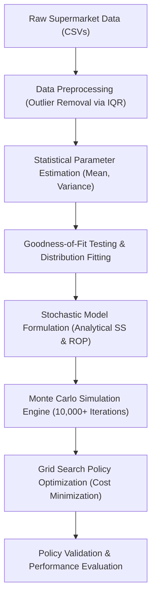

# Chapter 03: Methodology

## 3.1 Methodological Framework
The research methodology is structured as a data-driven, simulation-based optimization framework designed to compute optimal Safety Stocks ($SS$) and Reorder Points ($R$) for a multi-item supply chain under joint demand and lead-time uncertainty. The process consists of four main phases: Data Preparation, Stochastic Modeling, Monte Carlo Simulation, and Policy Optimization and Validation. The overall methodological flow is illustrated in the diagram below:

---

## 3.2 Data Preparation and Characterization
The empirical context of this study is established using three retail datasets containing 10,000 transactions across multiple retail stores:
1. **Sales Transactions Database** (`demand_forecasting.csv`): Tracks daily sales quantity ($D$) and unit prices ($Price$) for unique Product IDs.
2. **Inventory Status Database** (`inventory_monitoring.csv`): Details store-specific baseline parameters including current Stock Levels, Supplier Lead Times ($L$), baseline Reorder Points ($R$), and Warehouse Capacity.
3. **Pricing and Logistics Database** (`pricing_optimization.csv`): Provides unit storage costs ($h$) and competitor pricing data.

### 3.2.1 Outlier Removal
Raw demand and supplier lead-time data are subject to anomalous spikes due to data entry errors, system failures, or extreme black-swan logistics events. To prevent these anomalies from inflating safety stock calculations, we implement an **Interquartile Range (IQR)** outlier detection filter:
$$IQR = Q_3 - Q_1$$
Where $Q_1$ and $Q_3$ represent the 25th and 75th percentiles of the empirical distribution, respectively. Any observation $x$ falling outside the following interval is identified as an outlier and removed from the active analysis dataset:
$$x \notin [Q_1 - 1.5 \cdot IQR, \;\; Q_3 + 1.5 \cdot IQR]$$

### 3.2.2 Parameter Estimation
For each product category $i$, daily sales quantities are aggregated to estimate the mean daily demand ($\mu_{D,i}$) and standard deviation of daily demand ($\sigma_{D,i}$):
$$\mu_{D,i} = \frac{1}{M} \sum_{t=1}^M D_{i,t}$$
$$\sigma_{D,i} = \sqrt{\frac{1}{M-1} \sum_{t=1}^M (D_{i,t} - \mu_{D,i})^2}$$
Where $M$ is the number of historical sales records. Similarly, supplier lead times for each SKU are aggregated to determine the mean lead time ($\mu_{L,i}$) and standard deviation ($\sigma_{L,i}$):
$$\mu_{L,i} = \frac{1}{K} \sum_{j=1}^K L_{i,j}$$
$$\sigma_{L,i} = \sqrt{\frac{1}{K-1} \sum_{j=1}^K (L_{i,j} - \mu_{L,i})^2}$$
Where $K$ is the number of logistics lead-time observations for the SKU.

---

## 3.3 Statistical Distribution Fitting
Rather than relying on empirical bootstrapping, we fit standard theoretical probability distributions to demand and lead times. This allows the simulation engine to generate smooth, randomized scenarios representing long-tail events.

For daily demand, we evaluate the following distributions:
1. **Normal Distribution**: Suitable for high-volume, stable-demand items:
   $$f(x | \mu_D, \sigma_D) = \frac{1}{\sigma_D \sqrt{2\pi}} \exp\left( -\frac{(x - \mu_D)^2}{2\sigma_D^2} \right)$$
2. **Poisson Distribution**: Representing slow-moving, discrete-demand items:
   $$P(X = x) = \frac{\lambda^x e^{-\lambda}}{x!}, \quad \text{where } \lambda = \mu_D$$
3. **Lognormal and Gamma Distributions**: Characterizing highly skewed or seasonal demand spikes.

To evaluate the statistical validity of the fitted distributions, we perform **Kolmogorov-Smirnov (KS)** goodness-of-fit tests. The KS statistic ($D_{KS}$) measures the maximum vertical distance between the cumulative distribution function of the fitted model ($F_0(x)$) and the empirical cumulative distribution function ($F_n(x)$):
$$D_{KS} = \sup_{x} |F_n(x) - F_0(x)|$$
A fitted distribution is accepted if $D_{KS}$ is below the critical value at the $\alpha = 0.05$ significance level.

---

## 3.4 Stochastic Inventory Modeling
Under uncertainty, the **Demand During Lead Time ($DLT$)** is a random variable resulting from the convolution of the demand process and the lead-time distribution. If daily demand $D_t$ is independent and identically distributed, the mean lead-time demand ($\mu_{DLT}$) and standard deviation ($\sigma_{DLT}$) are derived analytically using **Ritchie's formulation**:
$$\mu_{DLT} = \mu_L \cdot \mu_D$$
$$\sigma_{DLT} = \sqrt{\mu_L \sigma_D^2 + \mu_D^2 \sigma_L^2}$$

### 3.4.1 Safety Stock ($SS$) Formulation
The safety stock ($SS$) required to maintain a target Cycle Service Level ($SL$) is calculated as:
$$SS = Z \cdot \sigma_{DLT}$$
Where $Z$ is the standard normal inverse of the target service level:
$$Z = \Phi^{-1}(SL)$$
For $SL = 95\%$, $Z = 1.645$.

### 3.4.2 Reorder Point ($R$) Formulation
The reorder point is the stock threshold that triggers a replenishment order:
$$R = \mu_{DLT} + SS$$

### 3.4.3 Economic Order Quantity ($Q$)
The fixed order size is determined using the Economic Order Quantity (EOQ) formula, which balances ordering costs and carrying costs over the planning horizon:
$$Q = \sqrt{\frac{2 \cdot \mu_D \cdot k}{h}}$$
Where:
- $k$: Ordering cost per replenishment order ($).
- $h$: Unit storage (holding) cost per day ($).

---

## 3.5 Monte Carlo Simulation Engine
We implement a continuous review $(Q, R)$ lost-sales simulation engine. The simulation tracks on-hand inventory levels and pipeline orders on a daily step over a 365-day planning horizon.

### 3.5.1 System State Variables
At any simulated day $t$, the system tracks:
- $I_t$: On-hand inventory level (units).
- $IP_t$: Inventory position, defined as:
  $$IP_t = I_t + \sum_{j \in \text{Transit}} q_j$$
  Where $q_j$ represents orders in transit.
- $O_t$: Orders in transit. Each order is tracked as a tuple $(A_j, Q)$, where $A_j$ is the scheduled arrival day.

### 3.5.2 Simulation Logic Flow
For each day $t \in [1, 365]$:
1. **Process Arrivals**: If any pipeline order has $A_j == t$, on-hand inventory is updated:
   $$I_t = I_{t-1} + Q$$
2. **Generate Demand**: A daily demand $D_t$ is sampled from the fitted normal distribution truncated at 0:
   $$D_t = \max\left(0, \lfloor \tilde{D}_t \rceil \right), \quad \text{where } \tilde{D}_t \sim N(\mu_D, \sigma_D^2)$$
3. **Fulfill Demand**:
   - If $I_t \ge D_t$, demand is fully met:
     $$I_t = I_{t-1} - D_t, \quad \text{Demands Met} \mathrel{+}= D_t$$
   - If $I_t < D_t$, the available inventory is exhausted, and the unsatisfied demand is recorded as a lost sale (shortage):
     $$\text{Shortage}_t = D_t - I_t, \quad \text{Demands Met} \mathrel{+}= I_t, \quad I_t = 0$$
4. **Evaluate Carrying Costs**:
   $$\text{Holding Cost}_t = I_t \cdot h$$
   $$\text{Shortage Cost}_t = \text{Shortage}_t \cdot C_s$$
5. **Check Reorder Condition**:
   Calculate inventory position $IP_t = I_t + \text{On-Order}$. If $IP_t \le R$, place a replenishment order of size $Q$:
   - Generate supplier lead time $L_t \sim N(\mu_L, \sigma_L^2)$, truncated at 1.
   - Schedule arrival day: $A_j = t + \lfloor L_t \rceil$.
   - Add to pipeline: $IP_t \mathrel{+}= Q$.
   - Accrued ordering cost: $\text{Ordering Cost} \mathrel{+}= k$.

---

## 3.6 Cost Minimization & Policy Optimization
The objective is to identify the optimal policy combination $(Q^*, R^*)$ that minimizes the total operational cost ($TC$) over the planning horizon:
$$\min_{Q, R} TC(Q, R) = \sum_{t=1}^T \left( h \cdot I_t + C_s \cdot \text{Shortage}_t + k \cdot Y_t \right)$$
Subject to the Cycle Service Level constraint:
$$SL(Q, R) \ge 0.95$$
Where $Y_t \in \{0, 1\}$ is a decision variable indicating if an order was placed on day $t$.

Optimization is performed using a **Grid Search Algorithm** over a detailed policy space:
- $R$ is searched within:
  $$R \in [\mu_{DLT} - 1 \cdot \sigma_{DLT}, \;\; \mu_{DLT} + 3 \cdot \sigma_{DLT}]$$
- $Q$ is searched within:
  $$Q \in [\min(EOQ, Q_{base}) \cdot 0.5, \;\; \max(EOQ, Q_{base}, \mu_{DLT}) \cdot 1.5]$$

By running the simulation for each point on the grid mesh, we generate the cost surface contour, verify the global minimum, and extract the optimal policy configurations.
