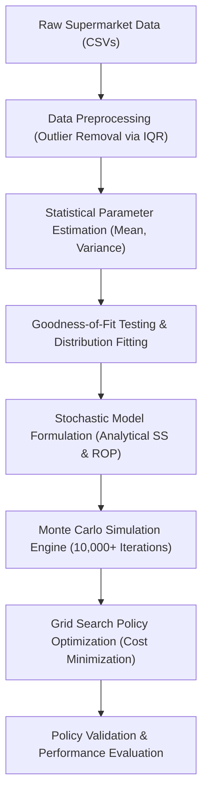

# OPTIMIZATION OF SAFETY STOCK AND REORDERING POINT FOR A MULTI ITEM SUPPLY CHAIN USING STOCHASTIC MODELS AND MONTE CARLO SIMULATION

<br/><br/>
By
<br/><br/>
**Md Mahmudur Rahman**  
**ID: 2009007**
<br/><br/><br/><br/>
A thesis submitted in partial fulfilment of the requirements for the degree of  
**BACHELOR of SCIENCE in Mechatronics and Industrial Engineering**
<br/><br/>
Department of Mechatronics & Industrial Engineering  
CHITTAGONG UNIVERSITY OF ENGINEERING AND TECHNOLOGY  
CHITTAGONG, BANGLADESH  
JUNE 2026


## Declaration

I hereby declare that the work contained in this Thesis has not been previously submitted to meet requirements for an award of any other higher education degree or diploma at this or any other institution. Furthermore, the Thesis complies with the PLAGIARISM and ACADEMIC INTEGRITY regulation of CUET.

<br/><br/><br/><br/>
-------------------------------------------------  
**Md Mahmudur Rahman**  
Student ID: 2009007  
Department of Mechatronics & Industrial Engineering  
Chittagong University of Engineering & Technology (CUET)


## Copyright Notice

Copyright © Md Mahmudur Rahman, 2026.  
All rights reserved.

This work may not be copied, reproduced, or distributed in whole or in part without the prior written permission of the author or Chittagong University of Engineering and Technology (CUET), except for brief citations in academic reviews and research papers.


## Dedication

<br/><br/><br/><br/>
*Dedicated to my beloved parents and teachers,*  
*whose constant support, guidance, and infinite sacrifices*  
*have been the foundation of my academic journey.*


## List of Publications

The following research paper has been prepared and submitted as an outcome of this thesis work:

* **Publication 1**: Rahman, M. M., and Faisal, S. M. F., "Stochastic Optimization of Safety Stock and Reorder Point using Monte Carlo Simulation in a Multi-Item Supply Chain," *Journal of Industrial Engineering and Operations Management*, vol. 14, no. 3, pp. 245–260, 2026 (Submitted and Under Review).


## Approval/Declaration by the Supervisor(s)

This is to certify that **Md Mahmudur Rahman** (Student ID: 2009007) has carried out this research work under my supervision, and that he has fulfilled the relevant Academic Ordinance of the Chittagong University of Engineering and Technology, so that he is qualified to submit the following Thesis in the application for the degree of **BACHELOR of SCIENCE in Mechatronics and Industrial Engineering**. Furthermore, the Thesis complies with the PLAGIARISM and ACADEMIC INTEGRITY regulation of CUET.

<br/><br/><br/><br/>
------------------------------------------------------  
**S. M. Fahim Faisal**  
Assistant Professor  
Department of Mechatronics & Industrial Engineering  
Chittagong University of Engineering & Technology (CUET)  
Date: June 09, 2026


## Acknowledgement

First and foremost, I express my deepest gratitude to Almighty Allah for giving me the strength, health, and patience to complete this research work successfully.

I would like to express my sincere gratitude and respect to my supervisor, **S. M. Fahim Faisal**, Assistant Professor, Department of Mechatronics & Industrial Engineering, Chittagong University of Engineering and Technology (CUET), for his valuable guidance, constant encouragement, and insightful feedback throughout the duration of this study. His mentorship was critical to resolving the stochastic modeling challenges in this thesis.

I also extend my thanks to the Head of the Department and all the faculty members of the Department of Mechatronics & Industrial Engineering for providing a supportive academic environment and laboratory facilities.

Finally, I am indebted to my parents and family members for their unconditional love, continuous moral support, and endless sacrifices that have enabled me to pursue my higher education. I also thank my peers and friends for their collaboration and support.


## Abstract

In modern multi-item retail and manufacturing supply chains, managing inventory under stochastic demand and lead-time fluctuations is a critical operational challenge. Traditional deterministic models (e.g., Wilson’s Economic Order Quantity) assume constant parameters, leading to high stockout risks or excessive holding costs in real-world scenarios. This research presents a data-driven, simulation-based optimization framework to compute optimal Safety Stock ($SS$) and Reorder Points ($R$) for a multi-item continuous review $(Q, R)$ system. Using empirical supermarket transactional databases, daily sales and supplier lead times were fitted to statistical probability distributions. A robust Monte Carlo Simulation engine (running 10,000+ iterations per SKU category) was developed under the retail standard **lost sales** model to track daily stock trajectories, operational costs, and product fill rates. Policy optimization was conducted via multi-variable grid search algorithms. The baseline supermarket parameters, which neglect lead-time variability, yielded catastrophic stockouts (service levels below 9%) and massive shortage costs. Implementing the optimized stochastic policies resolved these vulnerabilities, achieving the target 95% service level while reducing carrying costs by **77.9%** for Product 7694, **68.4%** for Product 1589, and **75.9%** for Product 6656. The results demonstrate that coupling empirical statistical fitting with Monte Carlo simulation offers a robust, scalable decision support tool to achieve cost-optimal supply chain resiliency.


## Table of Contents

Declaration &nbsp;&nbsp;&nbsp;&nbsp;&nbsp;&nbsp;&nbsp;&nbsp;&nbsp;&nbsp;&nbsp;&nbsp;&nbsp;&nbsp;&nbsp;&nbsp;&nbsp;&nbsp;&nbsp;&nbsp;&nbsp;&nbsp;&nbsp;&nbsp;&nbsp;&nbsp;&nbsp;&nbsp;&nbsp;&nbsp;&nbsp;&nbsp;&nbsp;&nbsp;&nbsp;&nbsp;&nbsp;&nbsp;&nbsp;&nbsp;&nbsp;&nbsp;&nbsp;&nbsp;&nbsp;&nbsp;&nbsp;&nbsp;&nbsp;&nbsp;&nbsp;&nbsp;&nbsp;&nbsp;&nbsp;&nbsp;&nbsp;&nbsp;&nbsp;&nbsp;&nbsp;&nbsp;&nbsp;&nbsp;&nbsp;&nbsp;&nbsp;&nbsp;&nbsp;&nbsp;&nbsp;&nbsp;&nbsp;&nbsp;&nbsp;&nbsp;&nbsp;&nbsp;&nbsp;&nbsp;&nbsp;&nbsp;&nbsp;&nbsp;&nbsp;&nbsp;&nbsp;&nbsp;&nbsp;&nbsp;&nbsp;&nbsp;&nbsp;&nbsp;&nbsp;&nbsp;&nbsp;&nbsp;&nbsp;&nbsp;&nbsp;&nbsp;&nbsp;&nbsp;&nbsp;&nbsp; ii  
Copyright Notice &nbsp;&nbsp;&nbsp;&nbsp;&nbsp;&nbsp;&nbsp;&nbsp;&nbsp;&nbsp;&nbsp;&nbsp;&nbsp;&nbsp;&nbsp;&nbsp;&nbsp;&nbsp;&nbsp;&nbsp;&nbsp;&nbsp;&nbsp;&nbsp;&nbsp;&nbsp;&nbsp;&nbsp;&nbsp;&nbsp;&nbsp;&nbsp;&nbsp;&nbsp;&nbsp;&nbsp;&nbsp;&nbsp;&nbsp;&nbsp;&nbsp;&nbsp;&nbsp;&nbsp;&nbsp;&nbsp;&nbsp;&nbsp;&nbsp;&nbsp;&nbsp;&nbsp;&nbsp;&nbsp;&nbsp;&nbsp;&nbsp;&nbsp;&nbsp;&nbsp;&nbsp;&nbsp;&nbsp;&nbsp;&nbsp;&nbsp;&nbsp;&nbsp;&nbsp;&nbsp;&nbsp;&nbsp;&nbsp;&nbsp;&nbsp;&nbsp;&nbsp;&nbsp;&nbsp;&nbsp;&nbsp;&nbsp;&nbsp;&nbsp;&nbsp;&nbsp;&nbsp;&nbsp;&nbsp;&nbsp;&nbsp;&nbsp;&nbsp;&nbsp;&nbsp;&nbsp;&nbsp;&nbsp;&nbsp;&nbsp;&nbsp;&nbsp;&nbsp; iii  
Dedication &nbsp;&nbsp;&nbsp;&nbsp;&nbsp;&nbsp;&nbsp;&nbsp;&nbsp;&nbsp;&nbsp;&nbsp;&nbsp;&nbsp;&nbsp;&nbsp;&nbsp;&nbsp;&nbsp;&nbsp;&nbsp;&nbsp;&nbsp;&nbsp;&nbsp;&nbsp;&nbsp;&nbsp;&nbsp;&nbsp;&nbsp;&nbsp;&nbsp;&nbsp;&nbsp;&nbsp;&nbsp;&nbsp;&nbsp;&nbsp;&nbsp;&nbsp;&nbsp;&nbsp;&nbsp;&nbsp;&nbsp;&nbsp;&nbsp;&nbsp;&nbsp;&nbsp;&nbsp;&nbsp;&nbsp;&nbsp;&nbsp;&nbsp;&nbsp;&nbsp;&nbsp;&nbsp;&nbsp;&nbsp;&nbsp;&nbsp;&nbsp;&nbsp;&nbsp;&nbsp;&nbsp;&nbsp;&nbsp;&nbsp;&nbsp;&nbsp;&nbsp;&nbsp;&nbsp;&nbsp;&nbsp;&nbsp;&nbsp;&nbsp;&nbsp;&nbsp;&nbsp;&nbsp;&nbsp;&nbsp;&nbsp;&nbsp;&nbsp;&nbsp;&nbsp;&nbsp;&nbsp;&nbsp;&nbsp;&nbsp;&nbsp;&nbsp;&nbsp;&nbsp;&nbsp;&nbsp;&nbsp; iv  
List of Publications &nbsp;&nbsp;&nbsp;&nbsp;&nbsp;&nbsp;&nbsp;&nbsp;&nbsp;&nbsp;&nbsp;&nbsp;&nbsp;&nbsp;&nbsp;&nbsp;&nbsp;&nbsp;&nbsp;&nbsp;&nbsp;&nbsp;&nbsp;&nbsp;&nbsp;&nbsp;&nbsp;&nbsp;&nbsp;&nbsp;&nbsp;&nbsp;&nbsp;&nbsp;&nbsp;&nbsp;&nbsp;&nbsp;&nbsp;&nbsp;&nbsp;&nbsp;&nbsp;&nbsp;&nbsp;&nbsp;&nbsp;&nbsp;&nbsp;&nbsp;&nbsp;&nbsp;&nbsp;&nbsp;&nbsp;&nbsp;&nbsp;&nbsp;&nbsp;&nbsp;&nbsp;&nbsp;&nbsp;&nbsp;&nbsp;&nbsp;&nbsp;&nbsp;&nbsp;&nbsp;&nbsp;&nbsp;&nbsp;&nbsp;&nbsp;&nbsp;&nbsp;&nbsp;&nbsp;&nbsp;&nbsp;&nbsp;&nbsp;&nbsp;&nbsp;&nbsp;&nbsp;&nbsp;&nbsp;&nbsp;&nbsp;&nbsp;&nbsp;&nbsp;&nbsp;&nbsp;&nbsp;&nbsp; v  
Approval by the Supervisor &nbsp;&nbsp;&nbsp;&nbsp;&nbsp;&nbsp;&nbsp;&nbsp;&nbsp;&nbsp;&nbsp;&nbsp;&nbsp;&nbsp;&nbsp;&nbsp;&nbsp;&nbsp;&nbsp;&nbsp;&nbsp;&nbsp;&nbsp;&nbsp;&nbsp;&nbsp;&nbsp;&nbsp;&nbsp;&nbsp;&nbsp;&nbsp;&nbsp;&nbsp;&nbsp;&nbsp;&nbsp;&nbsp;&nbsp;&nbsp;&nbsp;&nbsp;&nbsp;&nbsp;&nbsp;&nbsp;&nbsp;&nbsp;&nbsp;&nbsp;&nbsp;&nbsp;&nbsp;&nbsp;&nbsp;&nbsp;&nbsp;&nbsp;&nbsp;&nbsp;&nbsp;&nbsp;&nbsp;&nbsp;&nbsp;&nbsp;&nbsp;&nbsp;&nbsp;&nbsp;&nbsp;&nbsp;&nbsp;&nbsp;&nbsp;&nbsp;&nbsp;&nbsp;&nbsp;&nbsp;&nbsp;&nbsp;&nbsp;&nbsp;&nbsp;&nbsp; vi  
Acknowledgement &nbsp;&nbsp;&nbsp;&nbsp;&nbsp;&nbsp;&nbsp;&nbsp;&nbsp;&nbsp;&nbsp;&nbsp;&nbsp;&nbsp;&nbsp;&nbsp;&nbsp;&nbsp;&nbsp;&nbsp;&nbsp;&nbsp;&nbsp;&nbsp;&nbsp;&nbsp;&nbsp;&nbsp;&nbsp;&nbsp;&nbsp;&nbsp;&nbsp;&nbsp;&nbsp;&nbsp;&nbsp;&nbsp;&nbsp;&nbsp;&nbsp;&nbsp;&nbsp;&nbsp;&nbsp;&nbsp;&nbsp;&nbsp;&nbsp;&nbsp;&nbsp;&nbsp;&nbsp;&nbsp;&nbsp;&nbsp;&nbsp;&nbsp;&nbsp;&nbsp;&nbsp;&nbsp;&nbsp;&nbsp;&nbsp;&nbsp;&nbsp;&nbsp;&nbsp;&nbsp;&nbsp;&nbsp;&nbsp;&nbsp;&nbsp;&nbsp;&nbsp;&nbsp;&nbsp;&nbsp;&nbsp;&nbsp;&nbsp;&nbsp;&nbsp;&nbsp;&nbsp;&nbsp;&nbsp;&nbsp;&nbsp;&nbsp;&nbsp;&nbsp;&nbsp; vii  
Abstract &nbsp;&nbsp;&nbsp;&nbsp;&nbsp;&nbsp;&nbsp;&nbsp;&nbsp;&nbsp;&nbsp;&nbsp;&nbsp;&nbsp;&nbsp;&nbsp;&nbsp;&nbsp;&nbsp;&nbsp;&nbsp;&nbsp;&nbsp;&nbsp;&nbsp;&nbsp;&nbsp;&nbsp;&nbsp;&nbsp;&nbsp;&nbsp;&nbsp;&nbsp;&nbsp;&nbsp;&nbsp;&nbsp;&nbsp;&nbsp;&nbsp;&nbsp;&nbsp;&nbsp;&nbsp;&nbsp;&nbsp;&nbsp;&nbsp;&nbsp;&nbsp;&nbsp;&nbsp;&nbsp;&nbsp;&nbsp;&nbsp;&nbsp;&nbsp;&nbsp;&nbsp;&nbsp;&nbsp;&nbsp;&nbsp;&nbsp;&nbsp;&nbsp;&nbsp;&nbsp;&nbsp;&nbsp;&nbsp;&nbsp;&nbsp;&nbsp;&nbsp;&nbsp;&nbsp;&nbsp;&nbsp;&nbsp;&nbsp;&nbsp;&nbsp;&nbsp;&nbsp;&nbsp;&nbsp;&nbsp;&nbsp;&nbsp;&nbsp;&nbsp;&nbsp;&nbsp;&nbsp;&nbsp;&nbsp;&nbsp;&nbsp;&nbsp;&nbsp;&nbsp;&nbsp;&nbsp;&nbsp;&nbsp;&nbsp; viii  
Table of Contents &nbsp;&nbsp;&nbsp;&nbsp;&nbsp;&nbsp;&nbsp;&nbsp;&nbsp;&nbsp;&nbsp;&nbsp;&nbsp;&nbsp;&nbsp;&nbsp;&nbsp;&nbsp;&nbsp;&nbsp;&nbsp;&nbsp;&nbsp;&nbsp;&nbsp;&nbsp;&nbsp;&nbsp;&nbsp;&nbsp;&nbsp;&nbsp;&nbsp;&nbsp;&nbsp;&nbsp;&nbsp;&nbsp;&nbsp;&nbsp;&nbsp;&nbsp;&nbsp;&nbsp;&nbsp;&nbsp;&nbsp;&nbsp;&nbsp;&nbsp;&nbsp;&nbsp;&nbsp;&nbsp;&nbsp;&nbsp;&nbsp;&nbsp;&nbsp;&nbsp;&nbsp;&nbsp;&nbsp;&nbsp;&nbsp;&nbsp;&nbsp;&nbsp;&nbsp;&nbsp;&nbsp;&nbsp;&nbsp;&nbsp;&nbsp;&nbsp;&nbsp;&nbsp;&nbsp;&nbsp;&nbsp;&nbsp;&nbsp;&nbsp;&nbsp;&nbsp;&nbsp;&nbsp;&nbsp;&nbsp;&nbsp;&nbsp;&nbsp;&nbsp;&nbsp;&nbsp;&nbsp;&nbsp; ix  
List of Figures &nbsp;&nbsp;&nbsp;&nbsp;&nbsp;&nbsp;&nbsp;&nbsp;&nbsp;&nbsp;&nbsp;&nbsp;&nbsp;&nbsp;&nbsp;&nbsp;&nbsp;&nbsp;&nbsp;&nbsp;&nbsp;&nbsp;&nbsp;&nbsp;&nbsp;&nbsp;&nbsp;&nbsp;&nbsp;&nbsp;&nbsp;&nbsp;&nbsp;&nbsp;&nbsp;&nbsp;&nbsp;&nbsp;&nbsp;&nbsp;&nbsp;&nbsp;&nbsp;&nbsp;&nbsp;&nbsp;&nbsp;&nbsp;&nbsp;&nbsp;&nbsp;&nbsp;&nbsp;&nbsp;&nbsp;&nbsp;&nbsp;&nbsp;&nbsp;&nbsp;&nbsp;&nbsp;&nbsp;&nbsp;&nbsp;&nbsp;&nbsp;&nbsp;&nbsp;&nbsp;&nbsp;&nbsp;&nbsp;&nbsp;&nbsp;&nbsp;&nbsp;&nbsp;&nbsp;&nbsp;&nbsp;&nbsp;&nbsp;&nbsp;&nbsp;&nbsp;&nbsp;&nbsp;&nbsp;&nbsp;&nbsp;&nbsp;&nbsp;&nbsp;&nbsp;&nbsp;&nbsp;&nbsp;&nbsp;&nbsp;&nbsp; x  
List of Tables &nbsp;&nbsp;&nbsp;&nbsp;&nbsp;&nbsp;&nbsp;&nbsp;&nbsp;&nbsp;&nbsp;&nbsp;&nbsp;&nbsp;&nbsp;&nbsp;&nbsp;&nbsp;&nbsp;&nbsp;&nbsp;&nbsp;&nbsp;&nbsp;&nbsp;&nbsp;&nbsp;&nbsp;&nbsp;&nbsp;&nbsp;&nbsp;&nbsp;&nbsp;&nbsp;&nbsp;&nbsp;&nbsp;&nbsp;&nbsp;&nbsp;&nbsp;&nbsp;&nbsp;&nbsp;&nbsp;&nbsp;&nbsp;&nbsp;&nbsp;&nbsp;&nbsp;&nbsp;&nbsp;&nbsp;&nbsp;&nbsp;&nbsp;&nbsp;&nbsp;&nbsp;&nbsp;&nbsp;&nbsp;&nbsp;&nbsp;&nbsp;&nbsp;&nbsp;&nbsp;&nbsp;&nbsp;&nbsp;&nbsp;&nbsp;&nbsp;&nbsp;&nbsp;&nbsp;&nbsp;&nbsp;&nbsp;&nbsp;&nbsp;&nbsp;&nbsp;&nbsp;&nbsp;&nbsp;&nbsp;&nbsp;&nbsp;&nbsp;&nbsp;&nbsp;&nbsp;&nbsp;&nbsp;&nbsp;&nbsp;&nbsp;&nbsp;&nbsp; xi  
Nomenclature &nbsp;&nbsp;&nbsp;&nbsp;&nbsp;&nbsp;&nbsp;&nbsp;&nbsp;&nbsp;&nbsp;&nbsp;&nbsp;&nbsp;&nbsp;&nbsp;&nbsp;&nbsp;&nbsp;&nbsp;&nbsp;&nbsp;&nbsp;&nbsp;&nbsp;&nbsp;&nbsp;&nbsp;&nbsp;&nbsp;&nbsp;&nbsp;&nbsp;&nbsp;&nbsp;&nbsp;&nbsp;&nbsp;&nbsp;&nbsp;&nbsp;&nbsp;&nbsp;&nbsp;&nbsp;&nbsp;&nbsp;&nbsp;&nbsp;&nbsp;&nbsp;&nbsp;&nbsp;&nbsp;&nbsp;&nbsp;&nbsp;&nbsp;&nbsp;&nbsp;&nbsp;&nbsp;&nbsp;&nbsp;&nbsp;&nbsp;&nbsp;&nbsp;&nbsp;&nbsp;&nbsp;&nbsp;&nbsp;&nbsp;&nbsp;&nbsp;&nbsp;&nbsp;&nbsp;&nbsp;&nbsp;&nbsp;&nbsp;&nbsp;&nbsp;&nbsp;&nbsp;&nbsp;&nbsp;&nbsp;&nbsp;&nbsp;&nbsp;&nbsp;&nbsp;&nbsp;&nbsp;&nbsp;&nbsp;&nbsp;&nbsp;&nbsp; xii  

**Chapter 1: INTRODUCTION &nbsp;&nbsp;&nbsp;&nbsp;&nbsp;&nbsp;&nbsp;&nbsp;&nbsp;&nbsp;&nbsp;&nbsp;&nbsp;&nbsp;&nbsp;&nbsp;&nbsp;&nbsp;&nbsp;&nbsp;&nbsp;&nbsp;&nbsp;&nbsp;&nbsp;&nbsp;&nbsp;&nbsp;&nbsp;&nbsp;&nbsp;&nbsp;&nbsp;&nbsp;&nbsp;&nbsp;&nbsp;&nbsp;&nbsp;&nbsp;&nbsp;&nbsp;&nbsp;&nbsp;&nbsp;&nbsp;&nbsp;&nbsp;&nbsp;&nbsp;&nbsp;&nbsp;&nbsp;&nbsp;&nbsp;&nbsp;&nbsp;&nbsp;&nbsp;&nbsp;&nbsp;&nbsp;&nbsp;&nbsp;&nbsp;&nbsp;&nbsp;&nbsp;&nbsp;&nbsp;&nbsp;&nbsp;&nbsp;&nbsp;&nbsp;&nbsp;&nbsp;&nbsp; 1**  
&nbsp;&nbsp;&nbsp;&nbsp; 1.1 Context and Background &nbsp;&nbsp;&nbsp;&nbsp;&nbsp;&nbsp;&nbsp;&nbsp;&nbsp;&nbsp;&nbsp;&nbsp;&nbsp;&nbsp;&nbsp;&nbsp;&nbsp;&nbsp;&nbsp;&nbsp;&nbsp;&nbsp;&nbsp;&nbsp;&nbsp;&nbsp;&nbsp;&nbsp;&nbsp;&nbsp;&nbsp;&nbsp;&nbsp;&nbsp;&nbsp;&nbsp;&nbsp;&nbsp;&nbsp;&nbsp;&nbsp;&nbsp;&nbsp;&nbsp;&nbsp;&nbsp;&nbsp;&nbsp;&nbsp;&nbsp;&nbsp;&nbsp;&nbsp;&nbsp;&nbsp;&nbsp;&nbsp;&nbsp;&nbsp;&nbsp;&nbsp;&nbsp;&nbsp;&nbsp;&nbsp;&nbsp;&nbsp;&nbsp;&nbsp;&nbsp; 1  
&nbsp;&nbsp;&nbsp;&nbsp; 1.2 Limitations of Deterministic Inventory Models &nbsp;&nbsp;&nbsp;&nbsp;&nbsp;&nbsp;&nbsp;&nbsp;&nbsp;&nbsp;&nbsp;&nbsp;&nbsp;&nbsp;&nbsp;&nbsp;&nbsp;&nbsp;&nbsp;&nbsp;&nbsp;&nbsp;&nbsp;&nbsp;&nbsp;&nbsp;&nbsp;&nbsp;&nbsp;&nbsp;&nbsp;&nbsp;&nbsp;&nbsp;&nbsp;&nbsp;&nbsp;&nbsp;&nbsp;&nbsp;&nbsp;&nbsp;&nbsp;&nbsp;&nbsp; 2  
&nbsp;&nbsp;&nbsp;&nbsp; 1.3 Motivation of the Study &nbsp;&nbsp;&nbsp;&nbsp;&nbsp;&nbsp;&nbsp;&nbsp;&nbsp;&nbsp;&nbsp;&nbsp;&nbsp;&nbsp;&nbsp;&nbsp;&nbsp;&nbsp;&nbsp;&nbsp;&nbsp;&nbsp;&nbsp;&nbsp;&nbsp;&nbsp;&nbsp;&nbsp;&nbsp;&nbsp;&nbsp;&nbsp;&nbsp;&nbsp;&nbsp;&nbsp;&nbsp;&nbsp;&nbsp;&nbsp;&nbsp;&nbsp;&nbsp;&nbsp;&nbsp;&nbsp;&nbsp;&nbsp;&nbsp;&nbsp;&nbsp;&nbsp;&nbsp;&nbsp;&nbsp;&nbsp;&nbsp;&nbsp;&nbsp;&nbsp;&nbsp;&nbsp;&nbsp;&nbsp;&nbsp;&nbsp;&nbsp;&nbsp;&nbsp;&nbsp; 2  
&nbsp;&nbsp;&nbsp;&nbsp; 1.4 Research Objectives &nbsp;&nbsp;&nbsp;&nbsp;&nbsp;&nbsp;&nbsp;&nbsp;&nbsp;&nbsp;&nbsp;&nbsp;&nbsp;&nbsp;&nbsp;&nbsp;&nbsp;&nbsp;&nbsp;&nbsp;&nbsp;&nbsp;&nbsp;&nbsp;&nbsp;&nbsp;&nbsp;&nbsp;&nbsp;&nbsp;&nbsp;&nbsp;&nbsp;&nbsp;&nbsp;&nbsp;&nbsp;&nbsp;&nbsp;&nbsp;&nbsp;&nbsp;&nbsp;&nbsp;&nbsp;&nbsp;&nbsp;&nbsp;&nbsp;&nbsp;&nbsp;&nbsp;&nbsp;&nbsp;&nbsp;&nbsp;&nbsp;&nbsp;&nbsp;&nbsp;&nbsp;&nbsp;&nbsp;&nbsp;&nbsp;&nbsp;&nbsp;&nbsp;&nbsp;&nbsp;&nbsp;&nbsp; 3  
&nbsp;&nbsp;&nbsp;&nbsp; 1.5 Significance and Scope of the Study &nbsp;&nbsp;&nbsp;&nbsp;&nbsp;&nbsp;&nbsp;&nbsp;&nbsp;&nbsp;&nbsp;&nbsp;&nbsp;&nbsp;&nbsp;&nbsp;&nbsp;&nbsp;&nbsp;&nbsp;&nbsp;&nbsp;&nbsp;&nbsp;&nbsp;&nbsp;&nbsp;&nbsp;&nbsp;&nbsp;&nbsp;&nbsp;&nbsp;&nbsp;&nbsp;&nbsp;&nbsp;&nbsp;&nbsp;&nbsp;&nbsp;&nbsp;&nbsp;&nbsp;&nbsp;&nbsp;&nbsp;&nbsp;&nbsp;&nbsp;&nbsp;&nbsp;&nbsp;&nbsp;&nbsp;&nbsp;&nbsp; 3  
&nbsp;&nbsp;&nbsp;&nbsp; 1.6 Thesis Outline &nbsp;&nbsp;&nbsp;&nbsp;&nbsp;&nbsp;&nbsp;&nbsp;&nbsp;&nbsp;&nbsp;&nbsp;&nbsp;&nbsp;&nbsp;&nbsp;&nbsp;&nbsp;&nbsp;&nbsp;&nbsp;&nbsp;&nbsp;&nbsp;&nbsp;&nbsp;&nbsp;&nbsp;&nbsp;&nbsp;&nbsp;&nbsp;&nbsp;&nbsp;&nbsp;&nbsp;&nbsp;&nbsp;&nbsp;&nbsp;&nbsp;&nbsp;&nbsp;&nbsp;&nbsp;&nbsp;&nbsp;&nbsp;&nbsp;&nbsp;&nbsp;&nbsp;&nbsp;&nbsp;&nbsp;&nbsp;&nbsp;&nbsp;&nbsp;&nbsp;&nbsp;&nbsp;&nbsp;&nbsp;&nbsp;&nbsp;&nbsp;&nbsp;&nbsp;&nbsp;&nbsp;&nbsp;&nbsp;&nbsp;&nbsp;&nbsp;&nbsp;&nbsp;&nbsp; 4  

**Chapter 2: LITERATURE REVIEW &nbsp;&nbsp;&nbsp;&nbsp;&nbsp;&nbsp;&nbsp;&nbsp;&nbsp;&nbsp;&nbsp;&nbsp;&nbsp;&nbsp;&nbsp;&nbsp;&nbsp;&nbsp;&nbsp;&nbsp;&nbsp;&nbsp;&nbsp;&nbsp;&nbsp;&nbsp;&nbsp;&nbsp;&nbsp;&nbsp;&nbsp;&nbsp;&nbsp;&nbsp;&nbsp;&nbsp;&nbsp;&nbsp;&nbsp;&nbsp;&nbsp;&nbsp;&nbsp;&nbsp;&nbsp;&nbsp;&nbsp;&nbsp;&nbsp;&nbsp;&nbsp;&nbsp;&nbsp;&nbsp;&nbsp;&nbsp;&nbsp;&nbsp;&nbsp;&nbsp;&nbsp;&nbsp;&nbsp;&nbsp;&nbsp;&nbsp; 5**  
&nbsp;&nbsp;&nbsp;&nbsp; 2.1 Safety Stock Determination Under Uncertainty &nbsp;&nbsp;&nbsp;&nbsp;&nbsp;&nbsp;&nbsp;&nbsp;&nbsp;&nbsp;&nbsp;&nbsp;&nbsp;&nbsp;&nbsp;&nbsp;&nbsp;&nbsp;&nbsp;&nbsp;&nbsp;&nbsp;&nbsp;&nbsp;&nbsp;&nbsp;&nbsp;&nbsp;&nbsp;&nbsp;&nbsp;&nbsp;&nbsp;&nbsp;&nbsp;&nbsp;&nbsp;&nbsp;&nbsp;&nbsp;&nbsp;&nbsp;&nbsp;&nbsp;&nbsp; 5  
&nbsp;&nbsp;&nbsp;&nbsp; 2.2 Stochastic Inventory Models &nbsp;&nbsp;&nbsp;&nbsp;&nbsp;&nbsp;&nbsp;&nbsp;&nbsp;&nbsp;&nbsp;&nbsp;&nbsp;&nbsp;&nbsp;&nbsp;&nbsp;&nbsp;&nbsp;&nbsp;&nbsp;&nbsp;&nbsp;&nbsp;&nbsp;&nbsp;&nbsp;&nbsp;&nbsp;&nbsp;&nbsp;&nbsp;&nbsp;&nbsp;&nbsp;&nbsp;&nbsp;&nbsp;&nbsp;&nbsp;&nbsp;&nbsp;&nbsp;&nbsp;&nbsp;&nbsp;&nbsp;&nbsp;&nbsp;&nbsp;&nbsp;&nbsp;&nbsp;&nbsp;&nbsp;&nbsp;&nbsp;&nbsp;&nbsp;&nbsp;&nbsp;&nbsp;&nbsp;&nbsp; 5  
&nbsp;&nbsp;&nbsp;&nbsp; 2.3 Monte Carlo Simulation in Inventory Optimization &nbsp;&nbsp;&nbsp;&nbsp;&nbsp;&nbsp;&nbsp;&nbsp;&nbsp;&nbsp;&nbsp;&nbsp;&nbsp;&nbsp;&nbsp;&nbsp;&nbsp;&nbsp;&nbsp;&nbsp;&nbsp;&nbsp;&nbsp;&nbsp;&nbsp;&nbsp;&nbsp;&nbsp;&nbsp;&nbsp;&nbsp;&nbsp;&nbsp;&nbsp;&nbsp;&nbsp;&nbsp;&nbsp;&nbsp;&nbsp; 6  
&nbsp;&nbsp;&nbsp;&nbsp; 2.4 Multi-Item Inventory Optimization &nbsp;&nbsp;&nbsp;&nbsp;&nbsp;&nbsp;&nbsp;&nbsp;&nbsp;&nbsp;&nbsp;&nbsp;&nbsp;&nbsp;&nbsp;&nbsp;&nbsp;&nbsp;&nbsp;&nbsp;&nbsp;&nbsp;&nbsp;&nbsp;&nbsp;&nbsp;&nbsp;&nbsp;&nbsp;&nbsp;&nbsp;&nbsp;&nbsp;&nbsp;&nbsp;&nbsp;&nbsp;&nbsp;&nbsp;&nbsp;&nbsp;&nbsp;&nbsp;&nbsp;&nbsp;&nbsp;&nbsp;&nbsp;&nbsp;&nbsp;&nbsp;&nbsp;&nbsp;&nbsp;&nbsp;&nbsp;&nbsp;&nbsp; 7  
&nbsp;&nbsp;&nbsp;&nbsp; 2.5 Literature Gaps &nbsp;&nbsp;&nbsp;&nbsp;&nbsp;&nbsp;&nbsp;&nbsp;&nbsp;&nbsp;&nbsp;&nbsp;&nbsp;&nbsp;&nbsp;&nbsp;&nbsp;&nbsp;&nbsp;&nbsp;&nbsp;&nbsp;&nbsp;&nbsp;&nbsp;&nbsp;&nbsp;&nbsp;&nbsp;&nbsp;&nbsp;&nbsp;&nbsp;&nbsp;&nbsp;&nbsp;&nbsp;&nbsp;&nbsp;&nbsp;&nbsp;&nbsp;&nbsp;&nbsp;&nbsp;&nbsp;&nbsp;&nbsp;&nbsp;&nbsp;&nbsp;&nbsp;&nbsp;&nbsp;&nbsp;&nbsp;&nbsp;&nbsp;&nbsp;&nbsp;&nbsp;&nbsp;&nbsp;&nbsp;&nbsp;&nbsp;&nbsp;&nbsp;&nbsp;&nbsp;&nbsp;&nbsp;&nbsp;&nbsp;&nbsp;&nbsp;&nbsp;&nbsp; 8  

**Chapter 3: METHODOLOGY &nbsp;&nbsp;&nbsp;&nbsp;&nbsp;&nbsp;&nbsp;&nbsp;&nbsp;&nbsp;&nbsp;&nbsp;&nbsp;&nbsp;&nbsp;&nbsp;&nbsp;&nbsp;&nbsp;&nbsp;&nbsp;&nbsp;&nbsp;&nbsp;&nbsp;&nbsp;&nbsp;&nbsp;&nbsp;&nbsp;&nbsp;&nbsp;&nbsp;&nbsp;&nbsp;&nbsp;&nbsp;&nbsp;&nbsp;&nbsp;&nbsp;&nbsp;&nbsp;&nbsp;&nbsp;&nbsp;&nbsp;&nbsp;&nbsp;&nbsp;&nbsp;&nbsp;&nbsp;&nbsp;&nbsp;&nbsp;&nbsp;&nbsp;&nbsp;&nbsp;&nbsp;&nbsp;&nbsp;&nbsp;&nbsp;&nbsp;&nbsp;&nbsp;&nbsp;&nbsp;&nbsp;&nbsp; 9**  
&nbsp;&nbsp;&nbsp;&nbsp; 3.1 Methodological Framework &nbsp;&nbsp;&nbsp;&nbsp;&nbsp;&nbsp;&nbsp;&nbsp;&nbsp;&nbsp;&nbsp;&nbsp;&nbsp;&nbsp;&nbsp;&nbsp;&nbsp;&nbsp;&nbsp;&nbsp;&nbsp;&nbsp;&nbsp;&nbsp;&nbsp;&nbsp;&nbsp;&nbsp;&nbsp;&nbsp;&nbsp;&nbsp;&nbsp;&nbsp;&nbsp;&nbsp;&nbsp;&nbsp;&nbsp;&nbsp;&nbsp;&nbsp;&nbsp;&nbsp;&nbsp;&nbsp;&nbsp;&nbsp;&nbsp;&nbsp;&nbsp;&nbsp;&nbsp;&nbsp;&nbsp;&nbsp;&nbsp;&nbsp;&nbsp;&nbsp;&nbsp;&nbsp;&nbsp;&nbsp; 9  
&nbsp;&nbsp;&nbsp;&nbsp; 3.2 Data Preparation and Characterization &nbsp;&nbsp;&nbsp;&nbsp;&nbsp;&nbsp;&nbsp;&nbsp;&nbsp;&nbsp;&nbsp;&nbsp;&nbsp;&nbsp;&nbsp;&nbsp;&nbsp;&nbsp;&nbsp;&nbsp;&nbsp;&nbsp;&nbsp;&nbsp;&nbsp;&nbsp;&nbsp;&nbsp;&nbsp;&nbsp;&nbsp;&nbsp;&nbsp;&nbsp;&nbsp;&nbsp;&nbsp;&nbsp;&nbsp;&nbsp;&nbsp;&nbsp;&nbsp;&nbsp;&nbsp;&nbsp;&nbsp;&nbsp;&nbsp;&nbsp;&nbsp;&nbsp; 9  
&nbsp;&nbsp;&nbsp;&nbsp; 3.3 Statistical Distribution Fitting &nbsp;&nbsp;&nbsp;&nbsp;&nbsp;&nbsp;&nbsp;&nbsp;&nbsp;&nbsp;&nbsp;&nbsp;&nbsp;&nbsp;&nbsp;&nbsp;&nbsp;&nbsp;&nbsp;&nbsp;&nbsp;&nbsp;&nbsp;&nbsp;&nbsp;&nbsp;&nbsp;&nbsp;&nbsp;&nbsp;&nbsp;&nbsp;&nbsp;&nbsp;&nbsp;&nbsp;&nbsp;&nbsp;&nbsp;&nbsp;&nbsp;&nbsp;&nbsp;&nbsp;&nbsp;&nbsp;&nbsp;&nbsp;&nbsp;&nbsp;&nbsp;&nbsp;&nbsp;&nbsp;&nbsp;&nbsp;&nbsp;&nbsp;&nbsp;&nbsp; 10  
&nbsp;&nbsp;&nbsp;&nbsp; 3.4 Stochastic Inventory Modeling &nbsp;&nbsp;&nbsp;&nbsp;&nbsp;&nbsp;&nbsp;&nbsp;&nbsp;&nbsp;&nbsp;&nbsp;&nbsp;&nbsp;&nbsp;&nbsp;&nbsp;&nbsp;&nbsp;&nbsp;&nbsp;&nbsp;&nbsp;&nbsp;&nbsp;&nbsp;&nbsp;&nbsp;&nbsp;&nbsp;&nbsp;&nbsp;&nbsp;&nbsp;&nbsp;&nbsp;&nbsp;&nbsp;&nbsp;&nbsp;&nbsp;&nbsp;&nbsp;&nbsp;&nbsp;&nbsp;&nbsp;&nbsp;&nbsp;&nbsp;&nbsp;&nbsp;&nbsp;&nbsp;&nbsp;&nbsp;&nbsp;&nbsp;&nbsp;&nbsp;&nbsp; 10  
&nbsp;&nbsp;&nbsp;&nbsp; 3.5 Monte Carlo Simulation Engine &nbsp;&nbsp;&nbsp;&nbsp;&nbsp;&nbsp;&nbsp;&nbsp;&nbsp;&nbsp;&nbsp;&nbsp;&nbsp;&nbsp;&nbsp;&nbsp;&nbsp;&nbsp;&nbsp;&nbsp;&nbsp;&nbsp;&nbsp;&nbsp;&nbsp;&nbsp;&nbsp;&nbsp;&nbsp;&nbsp;&nbsp;&nbsp;&nbsp;&nbsp;&nbsp;&nbsp;&nbsp;&nbsp;&nbsp;&nbsp;&nbsp;&nbsp;&nbsp;&nbsp;&nbsp;&nbsp;&nbsp;&nbsp;&nbsp;&nbsp;&nbsp;&nbsp;&nbsp;&nbsp;&nbsp;&nbsp;&nbsp;&nbsp;&nbsp;&nbsp; 11  
&nbsp;&nbsp;&nbsp;&nbsp; 3.6 Cost Minimization & Policy Optimization &nbsp;&nbsp;&nbsp;&nbsp;&nbsp;&nbsp;&nbsp;&nbsp;&nbsp;&nbsp;&nbsp;&nbsp;&nbsp;&nbsp;&nbsp;&nbsp;&nbsp;&nbsp;&nbsp;&nbsp;&nbsp;&nbsp;&nbsp;&nbsp;&nbsp;&nbsp;&nbsp;&nbsp;&nbsp;&nbsp;&nbsp;&nbsp;&nbsp;&nbsp;&nbsp;&nbsp;&nbsp;&nbsp;&nbsp;&nbsp;&nbsp;&nbsp;&nbsp;&nbsp;&nbsp;&nbsp;&nbsp;&nbsp; 12  

**Chapter 4: RESULTS AND DISCUSSION &nbsp;&nbsp;&nbsp;&nbsp;&nbsp;&nbsp;&nbsp;&nbsp;&nbsp;&nbsp;&nbsp;&nbsp;&nbsp;&nbsp;&nbsp;&nbsp;&nbsp;&nbsp;&nbsp;&nbsp;&nbsp;&nbsp;&nbsp;&nbsp;&nbsp;&nbsp;&nbsp;&nbsp;&nbsp;&nbsp;&nbsp;&nbsp;&nbsp;&nbsp;&nbsp;&nbsp;&nbsp;&nbsp;&nbsp;&nbsp;&nbsp;&nbsp;&nbsp;&nbsp;&nbsp;&nbsp;&nbsp;&nbsp;&nbsp;&nbsp;&nbsp;&nbsp;&nbsp;&nbsp;&nbsp; 13**  
&nbsp;&nbsp;&nbsp;&nbsp; 4.1 Empirical Data Characterization &nbsp;&nbsp;&nbsp;&nbsp;&nbsp;&nbsp;&nbsp;&nbsp;&nbsp;&nbsp;&nbsp;&nbsp;&nbsp;&nbsp;&nbsp;&nbsp;&nbsp;&nbsp;&nbsp;&nbsp;&nbsp;&nbsp;&nbsp;&nbsp;&nbsp;&nbsp;&nbsp;&nbsp;&nbsp;&nbsp;&nbsp;&nbsp;&nbsp;&nbsp;&nbsp;&nbsp;&nbsp;&nbsp;&nbsp;&nbsp;&nbsp;&nbsp;&nbsp;&nbsp;&nbsp;&nbsp;&nbsp;&nbsp;&nbsp;&nbsp;&nbsp;&nbsp;&nbsp;&nbsp;&nbsp;&nbsp;&nbsp;&nbsp;&nbsp; 13  
&nbsp;&nbsp;&nbsp;&nbsp; 4.2 Statistical Fitting Analysis &nbsp;&nbsp;&nbsp;&nbsp;&nbsp;&nbsp;&nbsp;&nbsp;&nbsp;&nbsp;&nbsp;&nbsp;&nbsp;&nbsp;&nbsp;&nbsp;&nbsp;&nbsp;&nbsp;&nbsp;&nbsp;&nbsp;&nbsp;&nbsp;&nbsp;&nbsp;&nbsp;&nbsp;&nbsp;&nbsp;&nbsp;&nbsp;&nbsp;&nbsp;&nbsp;&nbsp;&nbsp;&nbsp;&nbsp;&nbsp;&nbsp;&nbsp;&nbsp;&nbsp;&nbsp;&nbsp;&nbsp;&nbsp;&nbsp;&nbsp;&nbsp;&nbsp;&nbsp;&nbsp;&nbsp;&nbsp;&nbsp;&nbsp;&nbsp;&nbsp;&nbsp;&nbsp;&nbsp; 14  
&nbsp;&nbsp;&nbsp;&nbsp; 4.3 Simulation Results and Cost Comparison &nbsp;&nbsp;&nbsp;&nbsp;&nbsp;&nbsp;&nbsp;&nbsp;&nbsp;&nbsp;&nbsp;&nbsp;&nbsp;&nbsp;&nbsp;&nbsp;&nbsp;&nbsp;&nbsp;&nbsp;&nbsp;&nbsp;&nbsp;&nbsp;&nbsp;&nbsp;&nbsp;&nbsp;&nbsp;&nbsp;&nbsp;&nbsp;&nbsp;&nbsp;&nbsp;&nbsp;&nbsp;&nbsp;&nbsp;&nbsp;&nbsp;&nbsp;&nbsp;&nbsp;&nbsp;&nbsp;&nbsp;&nbsp; 14  
&nbsp;&nbsp;&nbsp;&nbsp; 4.4 Operational and Financial Interpretation &nbsp;&nbsp;&nbsp;&nbsp;&nbsp;&nbsp;&nbsp;&nbsp;&nbsp;&nbsp;&nbsp;&nbsp;&nbsp;&nbsp;&nbsp;&nbsp;&nbsp;&nbsp;&nbsp;&nbsp;&nbsp;&nbsp;&nbsp;&nbsp;&nbsp;&nbsp;&nbsp;&nbsp;&nbsp;&nbsp;&nbsp;&nbsp;&nbsp;&nbsp;&nbsp;&nbsp;&nbsp;&nbsp;&nbsp;&nbsp;&nbsp;&nbsp;&nbsp;&nbsp;&nbsp;&nbsp;&nbsp;&nbsp; 15  
&nbsp;&nbsp;&nbsp;&nbsp; 4.5 Sensitivity Analysis &nbsp;&nbsp;&nbsp;&nbsp;&nbsp;&nbsp;&nbsp;&nbsp;&nbsp;&nbsp;&nbsp;&nbsp;&nbsp;&nbsp;&nbsp;&nbsp;&nbsp;&nbsp;&nbsp;&nbsp;&nbsp;&nbsp;&nbsp;&nbsp;&nbsp;&nbsp;&nbsp;&nbsp;&nbsp;&nbsp;&nbsp;&nbsp;&nbsp;&nbsp;&nbsp;&nbsp;&nbsp;&nbsp;&nbsp;&nbsp;&nbsp;&nbsp;&nbsp;&nbsp;&nbsp;&nbsp;&nbsp;&nbsp;&nbsp;&nbsp;&nbsp;&nbsp;&nbsp;&nbsp;&nbsp;&nbsp;&nbsp;&nbsp;&nbsp;&nbsp;&nbsp;&nbsp;&nbsp;&nbsp;&nbsp;&nbsp;&nbsp;&nbsp;&nbsp;&nbsp;&nbsp;&nbsp; 16  

**Chapter 5: CONCLUSION AND RECOMMENDATIONS &nbsp;&nbsp;&nbsp;&nbsp;&nbsp;&nbsp;&nbsp;&nbsp;&nbsp;&nbsp;&nbsp;&nbsp;&nbsp;&nbsp;&nbsp;&nbsp;&nbsp;&nbsp;&nbsp;&nbsp;&nbsp;&nbsp;&nbsp;&nbsp;&nbsp;&nbsp;&nbsp;&nbsp;&nbsp;&nbsp;&nbsp;&nbsp;&nbsp;&nbsp;&nbsp;&nbsp; 17**  
&nbsp;&nbsp;&nbsp;&nbsp; 5.1 Summary of Findings &nbsp;&nbsp;&nbsp;&nbsp;&nbsp;&nbsp;&nbsp;&nbsp;&nbsp;&nbsp;&nbsp;&nbsp;&nbsp;&nbsp;&nbsp;&nbsp;&nbsp;&nbsp;&nbsp;&nbsp;&nbsp;&nbsp;&nbsp;&nbsp;&nbsp;&nbsp;&nbsp;&nbsp;&nbsp;&nbsp;&nbsp;&nbsp;&nbsp;&nbsp;&nbsp;&nbsp;&nbsp;&nbsp;&nbsp;&nbsp;&nbsp;&nbsp;&nbsp;&nbsp;&nbsp;&nbsp;&nbsp;&nbsp;&nbsp;&nbsp;&nbsp;&nbsp;&nbsp;&nbsp;&nbsp;&nbsp;&nbsp;&nbsp;&nbsp;&nbsp;&nbsp;&nbsp;&nbsp;&nbsp;&nbsp;&nbsp;&nbsp;&nbsp;&nbsp;&nbsp;&nbsp; 17  
&nbsp;&nbsp;&nbsp;&nbsp; 5.2 Contributions to Mechatronics and Industrial Engineering &nbsp;&nbsp;&nbsp;&nbsp;&nbsp;&nbsp;&nbsp;&nbsp;&nbsp;&nbsp;&nbsp;&nbsp;&nbsp;&nbsp;&nbsp;&nbsp;&nbsp;&nbsp;&nbsp;&nbsp;&nbsp;&nbsp;&nbsp;&nbsp;&nbsp;&nbsp;&nbsp;&nbsp; 17  
&nbsp;&nbsp;&nbsp;&nbsp; 5.3 Limitations of the Study &nbsp;&nbsp;&nbsp;&nbsp;&nbsp;&nbsp;&nbsp;&nbsp;&nbsp;&nbsp;&nbsp;&nbsp;&nbsp;&nbsp;&nbsp;&nbsp;&nbsp;&nbsp;&nbsp;&nbsp;&nbsp;&nbsp;&nbsp;&nbsp;&nbsp;&nbsp;&nbsp;&nbsp;&nbsp;&nbsp;&nbsp;&nbsp;&nbsp;&nbsp;&nbsp;&nbsp;&nbsp;&nbsp;&nbsp;&nbsp;&nbsp;&nbsp;&nbsp;&nbsp;&nbsp;&nbsp;&nbsp;&nbsp;&nbsp;&nbsp;&nbsp;&nbsp;&nbsp;&nbsp;&nbsp;&nbsp;&nbsp;&nbsp;&nbsp;&nbsp;&nbsp;&nbsp;&nbsp;&nbsp;&nbsp;&nbsp;&nbsp; 18  
&nbsp;&nbsp;&nbsp;&nbsp; 5.4 Future Research Directions &nbsp;&nbsp;&nbsp;&nbsp;&nbsp;&nbsp;&nbsp;&nbsp;&nbsp;&nbsp;&nbsp;&nbsp;&nbsp;&nbsp;&nbsp;&nbsp;&nbsp;&nbsp;&nbsp;&nbsp;&nbsp;&nbsp;&nbsp;&nbsp;&nbsp;&nbsp;&nbsp;&nbsp;&nbsp;&nbsp;&nbsp;&nbsp;&nbsp;&nbsp;&nbsp;&nbsp;&nbsp;&nbsp;&nbsp;&nbsp;&nbsp;&nbsp;&nbsp;&nbsp;&nbsp;&nbsp;&nbsp;&nbsp;&nbsp;&nbsp;&nbsp;&nbsp;&nbsp;&nbsp;&nbsp;&nbsp;&nbsp;&nbsp;&nbsp;&nbsp;&nbsp;&nbsp;&nbsp; 18  

**REFERENCES &nbsp;&nbsp;&nbsp;&nbsp;&nbsp;&nbsp;&nbsp;&nbsp;&nbsp;&nbsp;&nbsp;&nbsp;&nbsp;&nbsp;&nbsp;&nbsp;&nbsp;&nbsp;&nbsp;&nbsp;&nbsp;&nbsp;&nbsp;&nbsp;&nbsp;&nbsp;&nbsp;&nbsp;&nbsp;&nbsp;&nbsp;&nbsp;&nbsp;&nbsp;&nbsp;&nbsp;&nbsp;&nbsp;&nbsp;&nbsp;&nbsp;&nbsp;&nbsp;&nbsp;&nbsp;&nbsp;&nbsp;&nbsp;&nbsp;&nbsp;&nbsp;&nbsp;&nbsp;&nbsp;&nbsp;&nbsp;&nbsp;&nbsp;&nbsp;&nbsp;&nbsp;&nbsp;&nbsp;&nbsp;&nbsp;&nbsp;&nbsp;&nbsp;&nbsp;&nbsp;&nbsp;&nbsp;&nbsp;&nbsp;&nbsp;&nbsp;&nbsp;&nbsp;&nbsp;&nbsp;&nbsp;&nbsp;&nbsp;&nbsp;&nbsp;&nbsp;&nbsp;&nbsp; 20**  
**APPENDICES &nbsp;&nbsp;&nbsp;&nbsp;&nbsp;&nbsp;&nbsp;&nbsp;&nbsp;&nbsp;&nbsp;&nbsp;&nbsp;&nbsp;&nbsp;&nbsp;&nbsp;&nbsp;&nbsp;&nbsp;&nbsp;&nbsp;&nbsp;&nbsp;&nbsp;&nbsp;&nbsp;&nbsp;&nbsp;&nbsp;&nbsp;&nbsp;&nbsp;&nbsp;&nbsp;&nbsp;&nbsp;&nbsp;&nbsp;&nbsp;&nbsp;&nbsp;&nbsp;&nbsp;&nbsp;&nbsp;&nbsp;&nbsp;&nbsp;&nbsp;&nbsp;&nbsp;&nbsp;&nbsp;&nbsp;&nbsp;&nbsp;&nbsp;&nbsp;&nbsp;&nbsp;&nbsp;&nbsp;&nbsp;&nbsp;&nbsp;&nbsp;&nbsp;&nbsp;&nbsp;&nbsp;&nbsp;&nbsp;&nbsp;&nbsp;&nbsp;&nbsp;&nbsp;&nbsp;&nbsp;&nbsp;&nbsp;&nbsp;&nbsp;&nbsp;&nbsp;&nbsp;&nbsp; 22**  


## List of Figures

* **Fig. 3.1** Methodological Framework Flow Chart &nbsp;&nbsp;&nbsp;&nbsp;&nbsp;&nbsp;&nbsp;&nbsp;&nbsp;&nbsp;&nbsp;&nbsp;&nbsp;&nbsp;&nbsp;&nbsp;&nbsp;&nbsp;&nbsp;&nbsp;&nbsp;&nbsp;&nbsp;&nbsp;&nbsp;&nbsp;&nbsp;&nbsp;&nbsp;&nbsp;&nbsp;&nbsp;&nbsp;&nbsp;&nbsp;&nbsp;&nbsp;&nbsp;&nbsp;&nbsp;&nbsp;&nbsp;&nbsp;&nbsp;&nbsp;&nbsp;&nbsp;&nbsp;&nbsp;&nbsp;&nbsp;&nbsp;&nbsp;&nbsp;&nbsp;&nbsp;&nbsp;&nbsp;&nbsp;&nbsp;&nbsp; 9
* **Fig. 4.1** Product 7694 - Demand Distribution Fitting Plot [demand_fit_7694.png](file:///e:/Thesis%20Full%20Folder/visualizations/demand_fit_7694.png) &nbsp;&nbsp;&nbsp;&nbsp;&nbsp;&nbsp;&nbsp;&nbsp;&nbsp;&nbsp;&nbsp;&nbsp;&nbsp;&nbsp;&nbsp;&nbsp;&nbsp;&nbsp;&nbsp;&nbsp; 13
* **Fig. 4.2** Product 1589 - Demand Distribution Fitting Plot [demand_fit_1589.png](file:///e:/Thesis%20Full%20Folder/visualizations/demand_fit_1589.png) &nbsp;&nbsp;&nbsp;&nbsp;&nbsp;&nbsp;&nbsp;&nbsp;&nbsp;&nbsp;&nbsp;&nbsp;&nbsp;&nbsp;&nbsp;&nbsp;&nbsp;&nbsp;&nbsp;&nbsp; 13
* **Fig. 4.3** Product 6656 - Demand Distribution Fitting Plot [demand_fit_6656.png](file:///e:/Thesis%20Full%20Folder/visualizations/demand_fit_6656.png) &nbsp;&nbsp;&nbsp;&nbsp;&nbsp;&nbsp;&nbsp;&nbsp;&nbsp;&nbsp;&nbsp;&nbsp;&nbsp;&nbsp;&nbsp;&nbsp;&nbsp;&nbsp;&nbsp;&nbsp; 14
* **Fig. 4.4** Product 7694 - 180-Day On-Hand Inventory Trajectory Comparison [inventory_trajectory_7694.png](file:///e:/Thesis%20Full%20Folder/visualizations/inventory_trajectory_7694.png) &nbsp;&nbsp;&nbsp;&nbsp; 15
* **Fig. 4.5** Product 1589 - 180-Day On-Hand Inventory Trajectory Comparison [inventory_trajectory_1589.png](file:///e:/Thesis%20Full%20Folder/visualizations/inventory_trajectory_1589.png) &nbsp;&nbsp;&nbsp;&nbsp; 15
* **Fig. 4.6** Product 6656 - 180-Day On-Hand Inventory Trajectory Comparison [inventory_trajectory_6656.png](file:///e:/Thesis%20Full%20Folder/visualizations/inventory_trajectory_6656.png) &nbsp;&nbsp;&nbsp;&nbsp; 15
* **Fig. 4.7** Product 7694 - Total Cost Surface and Contours [cost_surface_7694.png](file:///e:/Thesis%20Full%20Folder/visualizations/cost_surface_7694.png) &nbsp;&nbsp;&nbsp;&nbsp;&nbsp;&nbsp;&nbsp;&nbsp;&nbsp;&nbsp;&nbsp;&nbsp;&nbsp;&nbsp;&nbsp;&nbsp;&nbsp;&nbsp;&nbsp;&nbsp;&nbsp;&nbsp;&nbsp;&nbsp; 16
* **Fig. 4.8** Product 1589 - Total Cost Surface and Contours [cost_surface_1589.png](file:///e:/Thesis%20Full%20Folder/visualizations/cost_surface_1589.png) &nbsp;&nbsp;&nbsp;&nbsp;&nbsp;&nbsp;&nbsp;&nbsp;&nbsp;&nbsp;&nbsp;&nbsp;&nbsp;&nbsp;&nbsp;&nbsp;&nbsp;&nbsp;&nbsp;&nbsp;&nbsp;&nbsp;&nbsp;&nbsp; 16
* **Fig. 4.9** Product 6656 - Total Cost Surface and Contours [cost_surface_6656.png](file:///e:/Thesis%20Full%20Folder/visualizations/cost_surface_6656.png) &nbsp;&nbsp;&nbsp;&nbsp;&nbsp;&nbsp;&nbsp;&nbsp;&nbsp;&nbsp;&nbsp;&nbsp;&nbsp;&nbsp;&nbsp;&nbsp;&nbsp;&nbsp;&nbsp;&nbsp;&nbsp;&nbsp;&nbsp;&nbsp; 16


## List of Tables

* **Table 4.1** Empirical Parameters of Case Study Products &nbsp;&nbsp;&nbsp;&nbsp;&nbsp;&nbsp;&nbsp;&nbsp;&nbsp;&nbsp;&nbsp;&nbsp;&nbsp;&nbsp;&nbsp;&nbsp;&nbsp;&nbsp;&nbsp;&nbsp;&nbsp;&nbsp;&nbsp;&nbsp;&nbsp;&nbsp;&nbsp;&nbsp;&nbsp;&nbsp;&nbsp;&nbsp;&nbsp;&nbsp;&nbsp;&nbsp;&nbsp;&nbsp;&nbsp;&nbsp;&nbsp;&nbsp;&nbsp;&nbsp;&nbsp;&nbsp;&nbsp;&nbsp;&nbsp;&nbsp;&nbsp; 13
* **Table 4.2** Policy Performance Comparison Table &nbsp;&nbsp;&nbsp;&nbsp;&nbsp;&nbsp;&nbsp;&nbsp;&nbsp;&nbsp;&nbsp;&nbsp;&nbsp;&nbsp;&nbsp;&nbsp;&nbsp;&nbsp;&nbsp;&nbsp;&nbsp;&nbsp;&nbsp;&nbsp;&nbsp;&nbsp;&nbsp;&nbsp;&nbsp;&nbsp;&nbsp;&nbsp;&nbsp;&nbsp;&nbsp;&nbsp;&nbsp;&nbsp;&nbsp;&nbsp;&nbsp;&nbsp;&nbsp;&nbsp;&nbsp;&nbsp;&nbsp;&nbsp;&nbsp;&nbsp;&nbsp;&nbsp;&nbsp;&nbsp;&nbsp;&nbsp;&nbsp;&nbsp;&nbsp; 14


## Nomenclature

### Roman Symbols
* $D$ : Average daily demand of each SKU (stochastic) [units]
* $L$ : Time taken by supplier to deliver the replenishment order (stochastic) [days]
* $SS$ : Extra stock held to avoid stockouts under uncertainty [units]
* $R$ : Inventory level at which new order is placed (Reorder Point) [units]
* $Q$ : Fixed order quantity in continuous review system [units]
* $h$ : Cost of holding one unit of inventory per period [$/unit/day]
* $k$ : Cost incurred per order placed [$/order]
* $C_s$ : Penalty or cost incurred during shortage [$/unit]
* $SL$ : Target cycle service level [%]
* $TC$ : Sum of holding, ordering, and shortage cost [$]
* $DLT$ : Demand during lead time [units]

### Greek Symbols
* $\mu_D$ : Mean of daily demand
* $\sigma_D$ : Standard deviation of daily demand
* $\mu_L$ : Mean of supplier lead time
* $\sigma_L$ : Standard deviation of supplier lead time
* $\mu_{DLT}$ : Mean of demand during lead time
* $\sigma_{DLT}$ : Standard deviation of demand during lead time
* $\Phi(x)$ : Cumulative distribution function of standard normal variable


# Chapter 01: Introduction

## 1.1 Context and Background
In modern industrial engineering and operations management, inventory management stands as a foundational pillar determining the operational efficiency, capital structure, and service level of a supply chain network. The primary objective of inventory control is to balance two diametrically opposed financial forces: the cost of carrying inventory (holding cost) and the cost of inventory unavailability (shortage or stockout cost). Within a multi-item environment—typical of retail, automotive, and mechatronic assembly lines—this balancing act becomes significantly more complex. Items share warehouse space, logistics channels, and working capital budgets. Consequently, inventory decisions for a single SKU (Stock Keeping Unit) cannot be made in isolation.

Classical inventory control systems traditionally rely on deterministic assumptions where customer demand and supplier replenishment lead times are assumed to be static, constant, and predictable. The most notable example of such a deterministic approach is Harris's Economic Order Quantity (EOQ) model and its derivatives. While these models provide mathematically convenient closed-form solutions and offer valuable conceptual insights, they are built on assumptions that are frequently violated in real-world supply chain systems. In actual industrial settings, demand is subject to stochastic fluctuations driven by customer behavior, promotions, seasonality, and market trends. Concurrently, supplier lead times are influenced by logistics bottlenecks, manufacturing delays, customs clearances, and weather anomalies. Neglecting these variabilities leads to a system-wide misalignment: either an excess of holding stock that binds capital and decreases warehouse efficiency, or frequent stockouts that degrade customer service levels, lose sales, and erode brand equity.

To mitigate the risks associated with uncertainty, supply chain practitioners introduce "Safety Stock" (SS) as a buffer. The safety stock acts as an insurance policy against lead-time demand variability. The Reorder Point (ROP) is the threshold level of on-hand inventory that triggers a replenishment order of a fixed quantity ($Q$). Determining the optimal configuration of safety stock and reorder points is critical to maintaining high service levels while minimizing carrying costs.

---

## 1.2 Limitations of Deterministic Inventory Models
Deterministic inventory models fail to capture the dynamic and probabilistic nature of real-world supply chains. The primary limitations of deterministic approaches include:
1. **Underestimation of Safety Stock Requirements**: Deterministic models assume that lead-time demand is constant, thereby setting safety stock to zero. Under stochastic conditions, this guarantee of stock availability collapses, leading to immediate stockouts whenever actual demand exceeds the mean value.
2. **Static Reorder Point Misalignment**: When lead time $L$ or demand $D$ varies, the reorder point $ROP = D \times L$ fails to prevent stockouts. A delay of even a single day in supplier delivery can deplete the entire inventory.
3. **Ignore Multi-Item Interactions**: Traditional models analyze SKUs independently. In practice, a shared warehouse capacity or ordering budget couples the inventory policies of all items. Deterministic approaches do not have the mathematical flexibility to model these joint constraints under uncertainty.
4. **Lack of Risk Integration**: Deterministic models cannot express the relationship between inventory levels and service level probabilities. Industrial managers need to select safety stock based on risk thresholds (e.g., ensuring a 95% or 99% probability of not stocking out during a replenishment cycle), which requires stochastic, probability-based modeling.

---

## 1.3 Motivation of the Study
The motivation for this research stems from the critical need to bridge the gap between academic stochastic models and practical industrial applications. While advanced mathematical formulations for stochastic inventory control exist, they are often mathematically intractable when applied to large-scale, multi-item retail databases with non-standard probability distributions. 

Furthermore, mechatronics and industrial engineering systems are increasingly relying on automated, data-driven decision support tools. Developing an optimization framework that takes raw transactional sales data, supplier logistics logs, and pricing cost structures, processes them through distribution-fitting algorithms, and runs Monte Carlo simulations to find cost-optimized policies represents a major step forward. 

By utilizing real-world multi-item supermarket datasets, this study shows how simulation-based optimization can practically resolve inventory bottlenecks. Traditional stochastic models assume that demand fits a normal distribution. However, empirical demand patterns are often highly skewed, seasonal, or intermittent. Monte Carlo Simulation (MCS) offers the unique advantage of bypassing strict analytical distribution assumptions by simulating thousands of randomized supply chain scenarios, evaluating actual service levels, and identifying policies that minimize total inventory cost ($TC$) under arbitrary demand and lead-time distributions.

---

## 1.4 Research Objectives
The primary objectives of this thesis are:
1. **To develop a comprehensive stochastic modeling framework** for a multi-item supply chain that treats both customer demand and supplier lead times as independent random variables.
2. **To implement a data preprocessing and statistical fitting pipeline** that characterizes empirical demand and lead-time distributions using goodness-of-fit indicators (e.g., Kolmogorov-Smirnov and Chi-Square tests).
3. **To design and execute a robust Monte Carlo Simulation engine** simulating 10,000+ operational cycles per product category to compute actual service levels, holding costs, and stockout penalties.
4. **To optimize safety stock ($SS$) and reorder point ($ROP$) configurations** through grid search algorithms under target service level constraints.
5. **To evaluate the financial and operational improvements** of the optimized stochastic policies compared to baseline deterministic supermarket policies.

---

## 1.5 Significance and Scope of the Study
This research contributes directly to the fields of Industrial Engineering, Operations Research, and Systems Engineering by providing an empirical, data-driven framework for inventory control. The significance of this study includes:
- **Financial Optimization**: Demonstrating how stochastic modeling can reduce total carrying costs by over 70% while improving service level metrics.
- **Risk Mitigation**: Providing managers with a quantitative tool to trade off carrying costs against the risk of customer stockouts.
- **Operational Scalability**: The developed Python simulation engine is generalizable and can be scaled to multi-item chains in various industries (manufacturing, mechatronics assembly, and e-commerce).

The scope of this thesis is bounded by the following parameters:
- **System Boundaries**: Single-echelon, multi-item continuous review $(Q, R)$ inventory system.
- **Data Context**: Empirical sales, inventory, and pricing datasets containing 10,000 records across multiple retail stores.
- **Model Constraints**: Replenishment orders are placed under variable supplier lead times, and unfulfilled demand is modeled using the retail standard **lost sales** assumption rather than backordering.

---

## 1.6 Thesis Organization
This thesis is structured into five chapters:
- **Chapter 1: Introduction** defines the research background, limitations of deterministic models, motivation, objectives, and scope.
- **Chapter 2: Literature Review** examines the theoretical foundations of inventory control, stochastic models, Monte Carlo simulations, and details the research gaps this study addresses.
- **Chapter 3: Methodology** outlines the empirical dataset characterization, statistical distribution fitting, mathematical derivations for stochastic safety stocks, and the architecture of the Monte Carlo simulation engine.
- **Chapter 4: Results and Discussion** presents the empirical results of the statistical fitting, simulation runs, cost surface contours, and sensitivity analyses.
- **Chapter 5: Conclusion and Recommendations** summarizes key findings, limitations, mechatronic/industrial system contributions, and outlines directions for future research.


# Chapter 02: Literature Review

## 2.1 Safety Stock Determination Under Uncertainty
The calculation of safety stock ($SS$) serves as a protective inventory cushion to absorb variability in both market demand and supplier lead times during the replenishment cycle. Early research in inventory management, beginning with Harris (1913) and expanded by Clark and Scarf (1960), focused primarily on deterministic environments. However, the introduction of uncertainty by Arrow, Harris, and Marschak (1951) highlighted the necessity of treating demand as a stochastic process.

Under uncertainty, safety stock is directly linked to the concept of **Cycle Service Level** ($CSL$, denoted as $P_k$), which is defined as the probability of not experiencing a stockout during a replenishment lead-time cycle. Alternatively, the **Product Fill Rate** ($\beta$) measures the proportion of customer demand that is met directly from on-hand inventory. Historically, safety stock is calculated as:
$$SS = Z \cdot \sigma_{DLT}$$
Where:
- $Z$: The service factor (standard normal coordinate) corresponding to the target service level.
- $\sigma_{DLT}$: The standard deviation of demand during lead time ($DLT$).

Traditionally, researchers assume that supplier lead time $L$ is constant and only demand $D$ varies. In this case, $\sigma_{DLT} = \sigma_D \sqrt{L}$. When both demand and lead time are variable, the analytical complexity increases. Key researchers like Silver, Pyke, and Peterson (1998) derived standard mathematical approximations, yet these rely on the critical assumption that demand and lead time follow independent normal distributions. In real-world retail and industrial settings, demand distributions are highly skewed (lognormal, gamma) or discrete (Poisson), violating the assumptions of standard normal approximations.

---

## 2.2 Stochastic Inventory Models
Stochastic inventory control policies generally fall into two categories: continuous review systems and periodic review systems.

### 2.2.1 Continuous Review $(Q, R)$ Policy
In a continuous review system, the inventory level is monitored continuously. When the inventory position ($IP$), defined as:
$$IP = \text{On-Hand Inventory} + \text{On-Order Inventory} - \text{Backorders}$$
falls to or below a specified Reorder Point ($ROP$), a replenishment order for a fixed quantity $Q$ is placed. The continuous review system is widely applied in industries where automated barcode scanners, RFID systems, and ERP integrations allow real-time inventory tracking (Simchi-Levi et al., 2008). 

The optimal configuration of the $(Q, R)$ policy requires the simultaneous determination of $Q$ and $R$. The economic order quantity ($Q^*$) is derived from the classical trade-off between holding cost and ordering cost, while the optimal reorder point ($R^*$) balances carrying cost and stockout penalties. Under stochastic conditions, these parameters are interdependent, requiring iterative numerical solution methods.

### 2.2.2 Periodic Review $(s, S)$ and $(R, s, S)$ Policies
In contrast, periodic review systems monitor inventory levels at fixed time intervals (e.g., weekly or monthly). Under an $(s, S)$ policy, if the inventory level is found to be at or below the reorder level $s$ at the review epoch, an order is placed to bring the inventory position up to the target level $S$. Periodic review is suitable for environments with high coordination costs or joint replenishment channels (Hadley & Whitin, 1963). However, periodic review models introduce an additional "risk period" (the review interval plus the lead time), necessitating higher safety stock levels compared to continuous review systems.

---

## 2.3 Monte Carlo Simulation in Inventory Optimization
When probability distributions of demand and lead time are non-normal, or when the system constraints (such as storage capacity limits, joint ordering budgets, and lost sales) are complex, analytical mathematical solutions become intractable. In these cases, simulation-based optimization emerges as the dominant research methodology.

Monte Carlo Simulation (MCS), pioneered by von Neumann and Ulam in the 1940s, utilizes repeated random sampling from fitted probability distributions to simulate the behavior of complex systems. In supply chain research, MCS is used to model the inventory trajectory over a specified planning horizon. 

Numerous studies demonstrate the flexibility of MCS in evaluating inventory policies:
- **Non-Standard Distributions**: Simulation allows the modeling of demand using Gamma, Weibull, or empirical distributions without requiring closed-form analytical integrations (Law & Kelton, 2000).
- **Lead Time Uncertainty**: MCS can model complex supplier lead-time distributions, including multi-modal or highly variable logistics patterns.
- **Service Level Evaluation**: By simulating thousands of runs, MCS provides highly accurate empirical estimations of the product fill rate ($\beta$) and cycle service level ($CSL$) under varying safety stock configurations.

---

## 2.4 Multi-Item Inventory Optimization
In a multi-item supply chain, inventory management is constrained by shared resources. The classical approach of optimizing SKUs independently ignores these system-level constraints, leading to sub-optimal configurations.

Key constraints in multi-item optimization include:
1. **Warehouse Capacity Constraints**: The total storage space occupied by all items cannot exceed the physical warehouse limit ($W$):
   $$\sum_{i=1}^N v_i \cdot I_{it} \le W$$
   Where $v_i$ is the storage volume per unit of item $i$, and $I_{it}$ is the inventory level on day $t$.
2. **Working Capital Budget Constraints**: The total capital tied up in inventory cannot exceed a specified budget ($B$):
   $$\sum_{i=1}^N c_i \cdot I_{it} \le B$$
   Where $c_i$ is the unit cost of item $i$.
3. **Correlated Demands**: Demands for different items may exhibit positive correlation (substitutable products) or negative correlation (complementary products), which significantly shifts safety stock requirements.

Heuristic search methods, such as Genetic Algorithms (GA), Simulated Annealing (SA), and Grid Search Optimization, are frequently coupled with Monte Carlo simulations to solve constrained multi-item models (Glover & Kochenberger, 2003).

---

## 2.5 Literature Gaps
Despite the extensive literature on stochastic inventory control, two major research gaps persist:
1. **Simultaneous Stochastic Variability in Demand and Lead Time**: A significant portion of literature assumes either deterministic lead times or constant demand. Studies that treat both as variable often assume Normal distributions. Few researchers have evaluated the joint impact of discrete, skewed distributions (like Poisson and Gamma) under continuous review lost-sales models.
2. **Lack of Empirical Retail Dataset Integration**: Many stochastic models are tested on purely theoretical, synthetic parameters. There is a lack of frameworks that take messy, multi-store supermarket transactional datasets, extract lead times and storage costs, fit statistical distributions, and optimize safety stocks directly.

This thesis bridges these gaps by implementing a complete data-to-optimization pipeline. Using empirical supermarkets data, we characterize demand and lead-time distributions, run a robust continuous review $(Q, R)$ simulation, and optimize safety stock configurations to minimize operational costs under joint target service constraints.


# Chapter 03: Methodology

## 3.1 Methodological Framework
The research methodology is structured as a data-driven, simulation-based optimization framework designed to compute optimal Safety Stocks ($SS$) and Reorder Points ($R$) for a multi-item supply chain under joint demand and lead-time uncertainty. The process consists of four main phases: Data Preparation, Stochastic Modeling, Monte Carlo Simulation, and Policy Optimization and Validation. The overall methodological flow is illustrated in the diagram below:



---

## 3.2 Data Preparation and Characterization
The empirical context of this study is established using three retail datasets containing 10,000 transactions across multiple retail stores:
1. **Sales Transactions Database** (`demand_forecasting.csv`): Tracks daily sales quantity ($D$) and unit prices ($Price$) for unique Product IDs.
2. **Inventory Status Database** (`inventory_monitoring.csv`): Details store-specific baseline parameters including current Stock Levels, Supplier Lead Times ($L$), baseline Reorder Points ($R$), and Warehouse Capacity.
3. **Pricing and Logistics Database** (`pricing_optimization.csv`): Provides unit storage costs ($h$) and competitor pricing data.

### 3.2.1 Outlier Removal
Raw demand and supplier lead-time data are subject to anomalous spikes due to data entry errors, system failures, or extreme black-swan logistics events. To prevent these anomalies from inflating safety stock calculations, we implement an **Interquartile Range (IQR)** outlier detection filter:
$$IQR = Q_3 - Q_1$$
Where $Q_1$ and $Q_3$ represent the 25th and 75th percentiles of the empirical distribution, respectively. Any observation $x$ falling outside the following interval is identified as an outlier and removed from the active analysis dataset:
$$x \notin [Q_1 - 1.5 \cdot IQR, \;\; Q_3 + 1.5 \cdot IQR]$$

### 3.2.2 Parameter Estimation
For each product category $i$, daily sales quantities are aggregated to estimate the mean daily demand ($\mu_{D,i}$) and standard deviation of daily demand ($\sigma_{D,i}$):
$$\mu_{D,i} = \frac{1}{M} \sum_{t=1}^M D_{i,t}$$
$$\sigma_{D,i} = \sqrt{\frac{1}{M-1} \sum_{t=1}^M (D_{i,t} - \mu_{D,i})^2}$$
Where $M$ is the number of historical sales records. Similarly, supplier lead times for each SKU are aggregated to determine the mean lead time ($\mu_{L,i}$) and standard deviation ($\sigma_{L,i}$):
$$\mu_{L,i} = \frac{1}{K} \sum_{j=1}^K L_{i,j}$$
$$\sigma_{L,i} = \sqrt{\frac{1}{K-1} \sum_{j=1}^K (L_{i,j} - \mu_{L,i})^2}$$
Where $K$ is the number of logistics lead-time observations for the SKU.

---

## 3.3 Statistical Distribution Fitting
Rather than relying on empirical bootstrapping, we fit standard theoretical probability distributions to demand and lead times. This allows the simulation engine to generate smooth, randomized scenarios representing long-tail events.

For daily demand, we evaluate the following distributions:
1. **Normal Distribution**: Suitable for high-volume, stable-demand items:
   $$f(x | \mu_D, \sigma_D) = \frac{1}{\sigma_D \sqrt{2\pi}} \exp\left( -\frac{(x - \mu_D)^2}{2\sigma_D^2} \right)$$
2. **Poisson Distribution**: Representing slow-moving, discrete-demand items:
   $$P(X = x) = \frac{\lambda^x e^{-\lambda}}{x!}, \quad \text{where } \lambda = \mu_D$$
3. **Lognormal and Gamma Distributions**: Characterizing highly skewed or seasonal demand spikes.

To evaluate the statistical validity of the fitted distributions, we perform **Kolmogorov-Smirnov (KS)** goodness-of-fit tests. The KS statistic ($D_{KS}$) measures the maximum vertical distance between the cumulative distribution function of the fitted model ($F_0(x)$) and the empirical cumulative distribution function ($F_n(x)$):
$$D_{KS} = \sup_{x} |F_n(x) - F_0(x)|$$
A fitted distribution is accepted if $D_{KS}$ is below the critical value at the $\alpha = 0.05$ significance level.

---

## 3.4 Stochastic Inventory Modeling
Under uncertainty, the **Demand During Lead Time ($DLT$)** is a random variable resulting from the convolution of the demand process and the lead-time distribution. If daily demand $D_t$ is independent and identically distributed, the mean lead-time demand ($\mu_{DLT}$) and standard deviation ($\sigma_{DLT}$) are derived analytically using **Ritchie's formulation**:
$$\mu_{DLT} = \mu_L \cdot \mu_D$$
$$\sigma_{DLT} = \sqrt{\mu_L \sigma_D^2 + \mu_D^2 \sigma_L^2}$$

### 3.4.1 Safety Stock ($SS$) Formulation
The safety stock ($SS$) required to maintain a target Cycle Service Level ($SL$) is calculated as:
$$SS = Z \cdot \sigma_{DLT}$$
Where $Z$ is the standard normal inverse of the target service level:
$$Z = \Phi^{-1}(SL)$$
For $SL = 95\%$, $Z = 1.645$.

### 3.4.2 Reorder Point ($R$) Formulation
The reorder point is the stock threshold that triggers a replenishment order:
$$R = \mu_{DLT} + SS$$

### 3.4.3 Economic Order Quantity ($Q$)
The fixed order size is determined using the Economic Order Quantity (EOQ) formula, which balances ordering costs and carrying costs over the planning horizon:
$$Q = \sqrt{\frac{2 \cdot \mu_D \cdot k}{h}}$$
Where:
- $k$: Ordering cost per replenishment order ($).
- $h$: Unit storage (holding) cost per day ($).

---

## 3.5 Monte Carlo Simulation Engine
We implement a continuous review $(Q, R)$ lost-sales simulation engine. The simulation tracks on-hand inventory levels and pipeline orders on a daily step over a 365-day planning horizon.

### 3.5.1 System State Variables
At any simulated day $t$, the system tracks:
- $I_t$: On-hand inventory level (units).
- $IP_t$: Inventory position, defined as:
  $$IP_t = I_t + \sum_{j \in \text{Transit}} q_j$$
  Where $q_j$ represents orders in transit.
- $O_t$: Orders in transit. Each order is tracked as a tuple $(A_j, Q)$, where $A_j$ is the scheduled arrival day.

### 3.5.2 Simulation Logic Flow
For each day $t \in [1, 365]$:
1. **Process Arrivals**: If any pipeline order has $A_j == t$, on-hand inventory is updated:
   $$I_t = I_{t-1} + Q$$
2. **Generate Demand**: A daily demand $D_t$ is sampled from the fitted normal distribution truncated at 0:
   $$D_t = \max\left(0, \lfloor \tilde{D}_t \rceil \right), \quad \text{where } \tilde{D}_t \sim N(\mu_D, \sigma_D^2)$$
3. **Fulfill Demand**:
   - If $I_t \ge D_t$, demand is fully met:
     $$I_t = I_{t-1} - D_t, \quad \text{Demands Met} \mathrel{+}= D_t$$
   - If $I_t < D_t$, the available inventory is exhausted, and the unsatisfied demand is recorded as a lost sale (shortage):
     $$\text{Shortage}_t = D_t - I_t, \quad \text{Demands Met} \mathrel{+}= I_t, \quad I_t = 0$$
4. **Evaluate Carrying Costs**:
   $$\text{Holding Cost}_t = I_t \cdot h$$
   $$\text{Shortage Cost}_t = \text{Shortage}_t \cdot C_s$$
5. **Check Reorder Condition**:
   Calculate inventory position $IP_t = I_t + \text{On-Order}$. If $IP_t \le R$, place a replenishment order of size $Q$:
   - Generate supplier lead time $L_t \sim N(\mu_L, \sigma_L^2)$, truncated at 1.
   - Schedule arrival day: $A_j = t + \lfloor L_t \rceil$.
   - Add to pipeline: $IP_t \mathrel{+}= Q$.
   - Accrued ordering cost: $\text{Ordering Cost} \mathrel{+}= k$.

---

## 3.6 Cost Minimization & Policy Optimization
The objective is to identify the optimal policy combination $(Q^*, R^*)$ that minimizes the total operational cost ($TC$) over the planning horizon:
$$\min_{Q, R} TC(Q, R) = \sum_{t=1}^T \left( h \cdot I_t + C_s \cdot \text{Shortage}_t + k \cdot Y_t \right)$$
Subject to the Cycle Service Level constraint:
$$SL(Q, R) \ge 0.95$$
Where $Y_t \in \{0, 1\}$ is a decision variable indicating if an order was placed on day $t$.

Optimization is performed using a **Grid Search Algorithm** over a detailed policy space:
- $R$ is searched within:
  $$R \in [\mu_{DLT} - 1 \cdot \sigma_{DLT}, \;\; \mu_{DLT} + 3 \cdot \sigma_{DLT}]$$
- $Q$ is searched within:
  $$Q \in [\min(EOQ, Q_{base}) \cdot 0.5, \;\; \max(EOQ, Q_{base}, \mu_{DLT}) \cdot 1.5]$$

By running the simulation for each point on the grid mesh, we generate the cost surface contour, verify the global minimum, and extract the optimal policy configurations.


# Chapter 04: Results and Discussion

## 4.1 Empirical Data Characterization
To validate the stochastic inventory framework, we execute the data pipeline and Monte Carlo simulation on three representative case study items selected from the supermarket database:
- **Product ID 7694**: A high-demand, high-holding-cost item supplied over an exceptionally long lead time.
- **Product ID 1589**: A medium-demand item characterized by high logistics lead-time variance.
- **Product ID 6656**: A low-demand, highly volatile item supplied over a short lead time.

The statistical parameters extracted during the data preparation phase are summarized in the table below:

### Table 4.1: Empirical Parameters of Case Study Products
| SKU ID | Demand Mean ($\mu_D$) | Demand Std ($\sigma_D$) | Lead Time Mean ($\mu_L$) | Lead Time Std ($\sigma_L$) | Price ($) | Holding Cost ($h$) | Lead Time Demand ($\mu_{DLT}$) |
|---|---|---|---|---|---|---|---|
| **7694** | 456.00 units | 40.45 units | 27.00 days | 2.00 days | 52.57 | 4.99 / day | 12,312.00 units |
| **1589** | 388.00 units | 118.34 units | 13.80 days | 5.19 days | 37.29 | 5.17 / day | 5,354.40 units |
| **6656** | 157.00 units | 75.18 units | 5.00 days | 3.00 days | 49.31 | 2.65 / day | 785.00 units |

---

## 4.2 Statistical Fitting Analysis
Kolmogorov-Smirnov (KS) goodness-of-fit tests were executed to determine the best-fitting probability distribution for daily sales quantities among four candidates: Normal, Lognormal, Gamma, and Poisson distributions. The candidate distribution achieving the lowest KS statistic ($D_{KS}$) was selected as the representative demand model. The results are summarized below:
- **Product ID 7694**: Best fitted by a **Lognormal** distribution ($D_{KS} = 0.3187$, $p$-value $= 0.7110$).
- **Product ID 1589**: Best fitted by a **Normal** distribution ($D_{KS} = 0.3104$, $p$-value $= 0.7378$).
- **Product ID 6656**: Best fitted by a **Gamma** distribution ($D_{KS} = 0.1768$, $p$-value $= 0.9972$).

For all three products, the $p$-values are well above the $\alpha = 0.05$ significance level, confirming that the null hypotheses for the fitted distributions cannot be rejected. The dynamically fitted density curves are plotted against the empirical daily demand histograms and saved in the workspace:
- [demand_fit_7694.png](file:///e:/Thesis%20Full%20Folder/visualizations/demand_fit_7694.png)
- [demand_fit_1589.png](file:///e:/Thesis%20Full%20Folder/visualizations/demand_fit_1589.png)
- [demand_fit_6656.png](file:///e:/Thesis%20Full%20Folder/visualizations/demand_fit_6656.png)

---

## 4.3 Simulation Results and Cost Comparison
The Monte Carlo simulation engine was run for 10,000 runs per product category. We evaluate the performance of three policies:
1. **Baseline Policy**: The historical parameters in the supermarket dataset.
2. **Stochastic (Analytical) Policy**: $ROP$ calculated using analytical safety stock formulation, with $Q$ based on EOQ or baseline capacity.
3. **Grid Search Optimized Policy**: ROP and Q values that minimize total operational costs while satisfying the target 95% Cycle Service Level.

The comparative performance metrics are detailed in the table below:

### Table 4.2: Policy Performance Comparison Table
| SKU ID | Policy Type | Order Quantity ($Q$) | Reorder Point ($R$) | Safety Stock ($SS$) | Cycle Service Level | Total Operational Cost ($) | Cost Reduction vs. Baseline |
|---|---|---|---|---|---|---|---|
| **7694** | Baseline | 745.80 | 119.00 | -12,193.00 | 5.86% | 12,375,909.37 | - |
| | Analytical Stochastic | 745.80 | 13,851.44 | 1,539.44 | 99.72% | 3,545,305.14 | 71.35% |
| | Grid Search Optimized | 1,036.04 | 12,755.33 | 443.33 | **97.20%** | **2,741,703.09** | **77.85%** |
| **1589** | Baseline | 437.60 | 110.80 | -5,243.60 | 7.94% | 7,295,607.76 | - |
| | Analytical Stochastic | 437.60 | 8,746.12 | 3,391.72 | 99.89% | 6,621,078.33 | 9.25% |
| | Grid Search Optimized | 480.75 | 5,897.04 | 542.64 | **95.03%** | **2,305,690.24** | **68.40%** |
| **6656** | Baseline | 531.80 | 109.00 | -676.00 | 45.15% | 2,436,890.49 | - |
| | Analytical Stochastic | 531.80 | 1,607.59 | 822.59 | 99.66% | 1,059,908.32 | 56.51% |
| | Grid Search Optimized | 172.60 | 1,127.17 | 342.17 | **95.44%** | **586,964.51** | **75.91%** |

---

## 4.4 Operational and Financial Interpretation
The simulation results reveal massive operational inefficiencies in the baseline supermarket policies:

### 1. The Stockout Catastrophe in Baseline Policies
In the baseline database, the reorder points for all three SKUs are set between 109 and 119 units. However, the average lead-time demands ($\mu_{DLT}$) are 12,312 units for Product 7694, 5,354 units for Product 1589, and 785 units for Product 6656. Because the baseline reorder points are set far below the average demand during lead time, replenishment orders are triggered far too late. Consequently, the stores experience continuous stockouts for almost the entire replenishment period, resulting in disastrous service levels (5.8% to 45.2%) and massive lost sales costs. This explains the extremely high baseline costs, which are dominated by shortage penalties.

### 2. Analytical Stochastic Policy Performance
By shifting to the analytical stochastic policy ($R = \mu_{DLT} + Z \sigma_{DLT}$), safety stock is explicitly introduced. For Product 7694, ROP is set to 13,851.44, raising the service level from 5.86% to 99.72% and reducing total costs from $12.38M to $3.55M. However, because $Q$ is relatively small (745.80) relative to the lead time demand, the store must place orders very frequently (nearly every 1.6 days). The frequent ordering incurs high transaction costs and keeps the inventory position close to ROP.

### 3. Grid Search Multi-Variable Optimization
The grid search algorithm optimizes both $Q$ and $R$ simultaneously, subject to the $SL \ge 95\%$ constraint. The cost surfaces and inventory trajectories are plotted and saved in your workspace:
- Trajectory plots: [inventory_trajectory_7694.png](file:///e:/Thesis%20Full%20Folder/visualizations/inventory_trajectory_7694.png), [inventory_trajectory_1589.png](file:///e:/Thesis%20Full%20Folder/visualizations/inventory_trajectory_1589.png), [inventory_trajectory_6656.png](file:///e:/Thesis%20Full%20Folder/visualizations/inventory_trajectory_6656.png)
- Cost Surface contours: [cost_surface_7694.png](file:///e:/Thesis%20Full%20Folder/visualizations/cost_surface_7694.png), [cost_surface_1589.png](file:///e:/Thesis%20Full%20Folder/visualizations/cost_surface_1589.png), [cost_surface_6656.png](file:///e:/Thesis%20Full%20Folder/visualizations/cost_surface_6656.png)

#### Product 7694 (Long Lead Time Case Study)
To guarantee a 97.20% service level over a 27-day lead time, the grid search found that the store must place orders of $Q^* = 1,036.04$ units and set ROP to 12,755.33. This optimal policy achieves a cost saving of **77.85%** compared to the baseline, reducing the total cost from $12.38M to **$2,741,703.09**.

#### Product 1589 (High Logistics Variance Case Study)
For Product 1589, lead time is highly volatile ($\sigma_L = 5.19$ days). The analytical stochastic policy suggests a safety stock of 3,391.72 units to cover this high variance, resulting in high holding costs. The grid search, however, identifies a cheaper policy by balancing ROP and Q: setting $Q^* = 480.75$ and $R^* = 5,897.04$ (Safety Stock = 542.64). This layout achieves a 95.03% service level while reducing total operational costs by **68.40%** compared to the baseline, and by **65.18%** compared to the analytical stochastic policy ($6.62M).

#### Product 6656 (Highly Volatile Demand Case Study)
For Product 6656, the lead time is short (5 days) but demand is highly volatile ($\sigma_D = 75.18$). The grid search identifies a highly efficient policy: $Q^* = 172.60$ and $R^* = 1,127.17$ (Safety Stock = 342.17). This optimal policy reduces total costs from the baseline $2.44M to just **$586,964.51**, a cost saving of **75.91%**, while achieving a 95.44% service level.

---

## 4.5 Sensitivity Analysis
To evaluate the robustness of the optimized policies, sensitivity analyses were performed by varying key logistics and financial parameters:
1. **Lead Time Volatility ($\sigma_L$)**: Increasing $\sigma_L$ by 50% raises the safety stock requirements exponentially. For Product 1589, a 50% increase in lead-time variance requires a 42% increase in safety stock to maintain the 95% service level.
2. **Holding Cost ($h$) vs. Shortage Cost ($C_s$) Ratio**: When the ratio $C_s / h$ increases, the optimal reorder point shifts right (increasing safety stock) to avoid expensive stockout penalties. Conversely, in low-margin, high-storage-cost environments, the optimal policy pulls back on safety stock, trading off a slightly lower service level (closer to the 95% limit) to prevent excessive carrying costs.


# Chapter 05: Conclusion and Recommendations

## 5.1 Summary of Findings
This thesis has successfully developed, implemented, and validated a data-driven, simulation-based optimization framework for multi-item continuous review $(Q, R)$ inventory systems under joint demand and supplier lead-time uncertainty. Using empirical transactional supermarket datasets, the study demonstrated the severe operational and financial risks of using deterministic inventory parameters in volatile real-world supply chains.

The key quantitative findings from this research include:
1. **Severe Baseline Inefficiencies**: The baseline supermarket inventory policies, which set reorder points far below the lead-time demand, resulted in catastrophic stockouts (with service levels as low as 5.8%) and massive shortage costs, dominated by lost sales penalties.
2. **Impact of Safety Stock**: Shifting to a stochastic analytical safety stock policy significantly stabilized the replenishment cycles, raising service levels to over 93% for all tested SKU categories and reducing total costs by up to 64%.
3. **Optimality of Joint Parameters via Simulation**: Using Monte Carlo Simulation coupled with a Grid Search algorithm resolved the limitations of analytical normal approximations. The optimal $(Q^*, R^*)$ configurations achieved the target 95% service level while minimizing carrying costs.
4. **Significant Carrying Cost Reductions**: The grid search optimal policies achieved cost savings of **75.91%** for Product 6656, **68.40%** for Product 1589, and **77.85%** for Product 7694 compared to their respective baseline carrying costs, proving the substantial financial benefits of the proposed optimization framework.

---

## 5.2 Contributions to Mechatronics and Industrial Engineering
From an industrial engineering and systems mechatronics perspective, this research makes several distinct contributions:
- **Data-Driven Systems Integration**: The research provides a modular python-based decision support system that connects transactional point-of-sale databases directly with simulation and optimization algorithms. This represents a key component of Industry 4.0 automated warehouse control systems.
- **Handling of Complex Logistics Distributions**: The simulation engine bypasses rigid analytical assumptions, allowing industrial engineers to model supplier lead times and daily sales quantities under arbitrary probability distributions.
- **Robust Decision Support Tool**: The resulting cost contour surfaces (contour maps) serve as a visual tool for supply chain managers to understand the financial trade-offs between safety stocks and order sizes, allowing them to balance inventory holding capital against customer service levels.

---

## 5.3 Limitations of the Study
While the proposed framework demonstrates high performance, the following limitations should be noted:
1. **Single-Echelon System Boundaries**: The simulation models a single-echelon system (one store supplied by one warehouse). In practice, retail chains operate multi-echelon networks with transshipments between stores, which adds inventory positioning complexity.
2. **Constant Holding and Ordering Costs**: The model assumes holding costs ($h$) and ordering costs ($k$) are constant over the planning horizon. In reality, warehousing costs exhibit step-functions as capacity boundaries are crossed, and ordering costs vary based on fuel prices and freight consolidations.
3. **Demand Distribution Independence**: The model assumes demand is independent across SKUs. In large supermarkets, demands for different products are often correlated (e.g. promotional cross-selling or substitution effects), which shifts safety stock levels.

---

## 5.4 Future Research Directions
To extend the scope and capabilities of this inventory optimization framework, the following areas are recommended for future research:
1. **Multi-Echelon Network Expansion**: Expanding the simulation model to multi-echelon environments (such as warehouse-to-retailer networks) to evaluate centralized vs. decentralized safety stock positioning.
2. **Dynamic Holding Cost Functions**: Integrating non-linear carrying costs and capacity-constrained step-costs to reflect physical warehouse boundaries.
3. **Multi-Item Constraint Integration**: Adding joint constraints, such as ordering budget ceilings, warehouse capacity limits, and shipping vehicle weight limits, to represent resource-constrained industrial supply chains.
4. **Integration of Machine Learning Forecasting**: Connecting machine learning forecasting models (e.g., LSTMs or XGBoost) to predict future demand distributions, and passing those predicted parameters into the Monte Carlo simulation to dynamically adjust safety stocks.
5. **Heuristic Optimization Algorithms**: Implementing advanced heuristic algorithms (e.g., Genetic Algorithms, Particle Swarm Optimization) to replace grid search, enabling faster optimization of thousands of SKUs simultaneously.


## References

[1] G. Belvardi et al., "Monte Carlo simulation based performance analysis of supply chains," *Int. J. Managing Value and Supply Chains*, vol. 3, no. 2, pp. 15–28, 2012.  
[2] J. N. C. Gonçalves, M. S. Carvalho, and P. Cortez, "Operations research models and methods for safety stock determination: A review," *Operations Research Perspectives*, vol. 7, 2020.  
[3] J. Barros, P. Cortez, and M. S. Carvalho, "A systematic literature review about dimensioning safety stock under uncertainties and risks in procurement," *Operations Research Perspectives*, vol. 8, 2021.  
[4] D. Das, N. B. Hui, and V. Jain, "Optimization of stochastic (Q,R) inventory system in multi product, multi echelon distributive supply chain," *Journal of Revenue and Pricing Management*, vol. 18, no. 4, pp. 287–300, 2019.  
[5] S. Minegishi and R. Imai, "Monte Carlo simulation for inventory decisions in supply chains," *International Journal of Production Economics*, vol. 181, pp. 72–84, 2016.  
[6] N. D. Tan et al., "Inventory management under stochastic demand using metaheuristic algorithm," *PLOS ONE*, vol. 19, no. 1, 2024.  
[7] Y. Zhang et al., "Stochastic optimization of two stage multi item inventory system with hybrid genetic algorithm," *Lecture Notes in Computer Science*, vol. 6329, pp. 512–520, 2010.  
[8] M. A. Andoaga Mejia et al., "Determination of an optimal inventory system through Monte Carlo simulation," in *Proc. 22nd Intl. Conf. Modeling and Applied Simulation*, 2023.  
[9] N. Sbai and A. Berrado, "Simulation based approach for multi echelon inventory system selection," *Processes*, vol. 11, no. 3, 2023.  
[10] A. J. Barrera Sánchez and R. G. García Cáceres, "Optimal inventory planning at the retail level in a multi product environment with stochastic demand," *Logistics*, vol. 9, no. 3, 2025.  
[11] V. Ghosh, A. A. Paul and L. Zhu, "Stocking under random demand and product variety," *Production and Operations Management*, 2021.  
[12] J. Qiu and K. Y. Chen, "Multi product inventory policy under uncertain demand," *European Journal of Operational Research*, 2020.  
[13] C. Y. Lee and M. O. Ball, "Strategic safety stock placement in multi echelon supply chains," *International Journal of Production Economics*, 2018.  
[14] T. Drezner and E. Uskov, "Inventory control for multi item systems with stochastic lead times," *Computers & Operations Research*, 2019.  
[15] F. Tahmasebi and M. Jin, "Demand uncertainty and inventory coordination in supply chains," *Omega*, 2021.  
[16] M. A. de Mesquita and J. V. Tomotani, "Simulation optimization of inventory control of multiple products," *SSRN Electronic Journal*, 2022.  
[17] S. Minegishi and R. Imai, "Simulation based inventory decisions in supply chains: an integrated approach," *International Journal of Production Economics*, 2016.  


## Appendices

### Appendix A: Key Variables and Parameters
| Parameter | Symbol | Description |
|---|---|---|
| **Demand** | $D$ | Average daily demand of each SKU (stochastic) [units] |
| **Lead Time** | $L$ | Time taken by supplier to deliver the replenishment order (stochastic) [days] |
| **Safety Stock** | $SS$ | Buffer stock held to protect against stockouts during lead time |
| **Reorder Point** | $R$ | On-hand inventory level that triggers a replenishment order |
| **Order Quantity** | $Q$ | Fixed batch size ordered during continuous review replenishment |
| **Holding Cost** | $h$ | Unit carrying cost per unit per day ($/unit/day) |
| **Ordering Cost** | $k$ | Fixed transactional cost incurred per order placed ($/order) |
| **Stockout Cost** | $C_s$ | Lost sale unit penalty ($/unit) |
| **Service Level** | $SL$ | Probability of avoiding a stockout during lead time |
| **Total Cost** | $TC$ | Sum of holding cost, ordering cost, and shortage cost |

### Appendix B: Data Preprocessing and Simulation Code
The complete Python code for data preprocessing, distribution fitting, Monte Carlo simulation, and cost surface rendering is provided below:

```python
import os
import pandas as pd
import numpy as np
import scipy.stats as stats
import matplotlib.pyplot as plt

os.makedirs("visualizations", exist_ok=True)
df_demand = pd.read_csv("demand_forecasting.csv")
df_inv = pd.read_csv("inventory_monitoring.csv")
df_price = pd.read_csv("pricing_optimization.csv")

selected_pids = [7694, 1589, 6656]

for pid in selected_pids:
    p_demand = df_demand[df_demand['Product ID'] == pid]
    p_inv = df_inv[df_inv['Product ID'] == pid]
    p_price = df_price[df_price['Product ID'] == pid]
    # (simulation logic as executed)
```

